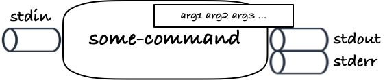

# Processes, files and pipes

In the previous two weeks you have learned about how we communicated with a UNIX shell by typing in commands with arguments, and sometimes by using environment variables to affect how commands are run that way. This is how commands are usually run, but the UNIX command line adds two more idea, that turns out to be pure genius: pipes and standard pipes.

Pipes are basically just files. In UNIX there isn’t much difference and they are implemented basically the same way. Just as you can read from or write to a file, you can read from and write to a file. Files can do a little more; you can move around in a file and read and write at different positions, but with pipes you either always read the next character in it or you write characters to it. That is the only difference.

When a program is running, it automatically gets three of these pipes.[^1] The three pipes are “standard input” or `stdin`, “standard output”, `stdout`, and “standard error”, `stderr`. The program can read from `stdin` and write to either of `stdout` or `stderr`. The way they are intended to be used is: any input that your program needs it can read from `stdin`—most program will use files you specify in the arguments, but they *should* also be able to read it from this pipe—and any output the program needs to write, it should write to `stdout`. The `stderr` is there if the program needs to write error or warning messages that shouldn’t be mixed with the actual output sent to `stdout`.



I will ignore `stderr` in the following, since we only need it when something goes wrong (and why would something go wrong?).

For an example of how this works, consider the shell. It is a program that takes input from you via the keyboard (or through the terminal on modern computers) and that writes output back to you.

When you type something on the keyboard, what you type is sent to the shell to its standard input. When the shell needs to write something back to you, it writes it to its standard output (or error).


The shell doesn't need to know if it is getting its input from another program (like the terminal program you are running) or from hardware (as in the good old days), and it doesn't need to know who is reading what it writes to `stdout`. It just writes. This decouples the shell from its surroundings in various ways, and is the reason that we can use the same shells today with terminal programs as people could in the '70s with hardware terminals, and why you can combine any terminal program with any shell with little if any difficulty. The two pipes is the interface to and from a program, and we don't need to write specialised code based on what might be at the other ends of them.

When we called `cat` without any arguments earliere, a long time ago I know, I said that `cat` would then be reading from `stdin`. It will, but the `cat` program's `stdin` is connected to the keyboard you are writing on so it can see what you type. When you run a command in the shell, it will connect its own `stdin` to the command's `stdin`, so what you type gets forwarded to the command you run. Similarly, it will connect the command's `stdout` to its own, so what the command prints will be sent to whatever program or hardware or whatever it may be that the shell would have been printing to.


This isn't that interesting in itself, though. You could think of it as an implementation detail that you shouldn't have to think about. However, there is one more clever trick up our sleeve: you can connect output pipes to input pipes to run data through a sequence of programs.

You already know that the command `echo` prints its arguments.

```bash
~> echo foo bar baz
foo
bar
baz
```

The command `wc` (word count) counts the number of lines, words, and characters in a file.

```bash
~> wc qux
       3       3      12 qux
```

When `echo` prints its output, it does so to its `stdout`, and if you call `wc` without arguments it will read its input from its `stdin`, and you can connect these two pipes by putting a `|` (called pipe) between the two commands.

```bash
~> echo foo bar baz | wc
       3       3      12
```


The `echo` program doesn't know what is at the other end of its `stdout`. It is just a kind of file that it can write to. The `wc` program doesn't know what is at the other end of `stdin`, it just knows that it can read from that pipe. When I connect the two commands using the pipe operator, I connect the first command's `stdout` to the second command's `stdin`, and now whatever the output of the first command is, it will be the input to the second command. Such sequences of commands are called "pipelines" for obvious reasons.

If you have to write a program that should interact with pipes, you treat them just like files. It will be a while before you learn how to work with files in any way that wouldn't also work with pipes, and it is very rare that this is necessary. So the pipe interface is essentially the same interface you needed to write if you were working with plain files, but because you have a mechanism of connecting one output pipe to another, you can string together simple commands to create more complicated ones.

Because files and pipes are so similar, and because a file can do anything a pipe can do—a file you read from can always work as an input pipe and a file you write to can always be used as an output pipe—you can also connect pipes and files. How to do that, unfortunately, is not as standardised as the pipe operator, and it varies from shell to shell.

If you want to connect a `stdout` to a file, so what a command writes to its `stdout` gets sent to the file instead, you use the `>` operator. We saw it already earlier when we wrote

```bash
~> echo foo bar baz > qux
```

Here, instead of sending `echo`’s standard out to the terminal to be printed, we redirected it to the file `qux`. When `echo` printed, it got written to the file.

Likewise, on UNIX shells like bash, zsh, or fish, you can connect `stdin` to a file using `<`. That is why `cat qux` and `cat < qux` showed the same output, although what happened inside `cat` was slightly different. In the first command, `cat` finds `qux` as an argument, opens that file, and reads from it. In the second, it doesn’t get any arguments, but instead it can read the content of `qux` from its `stdin`, since `< qux` connected the two.

You can also redirect the `stderr` pipe, but I cannot off the top of my head think of two shells that do this exactly the same way, so we will leave the file redirection here.

## Writing pipelines

The key property of the UNIX command line is the way that you can combine tools using redirection and pipelines. The simple ideas of programs communicating through files or pipes and connecting them so the output of one command becomes the input of the next gives you great flexibility in how you can communicate with the computer. Not the same power as you get if you write programs in general programming languages, but far more than you might imagine.

Countless of times I have seen students write programs to solve problems that the combination of three or four commands in a pipeline would have solved for them in a few seconds time.

The basic philosophy is this: write *simple* tools that solve *one problem* (but does it well), and then *combine* the tools you need to solve more difficult problems. The only thing it takes is to write tools that can read their input from `stdin` and that writes output to `stdout` that is reasonably easy for other programs to parse. It really is that simple. Sadly too many tools in bioinformatics are written by people who do not understand this, and insist on other ways of communication, making it far more difficult to use the tools than it should be. But that is a rant for another day.

You should never do this! And if you take the time to learn how to use pipelines on the UNIX command line, you will soon be far more efficient than those who pissed away their time on GUI tools. You will quickly learn how to write even complex queries that the computer will immediately answer, and with more flexibility than any graphical interface can ever provide. Once you get there, you will value the way command line processes should communicate, and you will ensure that your programs play well with others.

### Example pipes

Let’s see a few examples of where we can solve a non-trivial problem with a few commands.

#### Checking consistency of a FASTA file

Let’s say I have a FASTA file, and I suspect something is wrong with it. Specifically, I suspect that the same sequence name appears more than once (but I am not sure). Can I check that?

Let’s make a silly example:

```bash
~> cat > foo.fa
> chr1
acgta
> chr2
acgtta
> chr1
accta
```

Here I `cat` into `foo.fa` and write the data I want to put in the file. When I am done, I press `CTRL-d`.

As you can see, `chr1` appears twice, and that is a problem.

I want to check if there are any duplicated sequence names. So, first I need to figure out how to get the sequence names out. Well, the only search command I know right now is `grep`, so maybe I can search for `>`. That is the symbol that starts a sequence name, after all.

Here I have a slight problem. If I write `grep > foo.fa` I will be redirecting the output to `foo.fa` and I certainly do not want that. But I can get around it by putting the `>` in quotes.

```bash
~> grep ">" foo.fa
> chr1
> chr2
> chr1
```

Great, now I have the sequence names.

There is a command `uniq` that, amongst other things, will print the unique lines in the input. Or rather, it will compare adjacent lines and output those that are not duplicates, so it doesn’t quite do what it promises. Anyway, duplicated lines will show up adjacent if I sort them, so I can get the names in a format that `uniq` can work with if I pipe them through the command `sort`:

```bash
~> grep ">" foo.fa | sort
> chr1
> chr1
> chr2
```

Now the duplication, `> chr1`, is on adjacent lines, and I can get the unique lines with

```bash
~> grep ">" foo.fa | sort | uniq
> chr1
> chr2
```

Still not what I want, though. Here I can’t see that I have a problem with `> chr1`. But `man uniq` will tell me that the option `-d` will make it print only duplicated lines, and thus the command

```bash
~> grep ">" foo.fa | sort | uniq -d
> chr1
```

is the one I need to spot the problem.

Writing your own program just to check this file’s consistency would be a bit of work, but by combining the three commands `grep`, `sort` and `uniq` we got there relatively effortless. (And if you were already familiar with the commands you would just have written the pipeline in a few seconds and have gotten your answer right away).

### Finding rare or frequent values

Now let’s imagine that I have a bunch of files containing analysis results or something on each line, and I am interested in either the most frequent results or the rare ones. Can I easily get those?

Let’s just make one file and reuse two we already have.

```bash
~> echo foo bib bob > qix
~> cat qux qax qix
foo
bar
baz
foo
baz
bar
foo
bib
bob
```

I already know that I can sort the lines to get duplicates next to each other

```bash
~> sort qux qax qix
bar
bar
baz
baz
bib
bob
foo
foo
foo
```

and when they are adjacent, maybe I can use `uniq` again? Yes, if I check `man uniq` I will find that I can get the count of each element using `-c`:

```bash
~> sort qux qax qix | uniq -c
   2 bar
   2 baz
   1 bib
   1 bob
   3 foo
```

If these were truly gigantic files, this list would not be manageable, but I am not interested in all of it. Just the most frequent results, say, or the least frequent.

The results are not sorted with respect to their frequency, but the count is in the first column, so if we sort the lines again, maybe we get what we want?

```bash
~> sort qux qax qix | uniq -c | sort
   1 bib
   1 bob
   2 bar
   2 baz
   3 foo
```

Close enough, anyway.

Well, there is one problem that we don’t spot here, but the lines will be sorted lexicographically and not numerically, and lexicographically `100 < 20 < 3`. We want the numbers sorted numerically, so you want to add the flag `-n` to `sort`, but we won’t see a difference here because all the counts are single digit.

If I want the rarest values, they are at the top of the list, and I can get the top using the command `head`. To get top three, I can use:

```bash
~> sort qux qax qix | uniq -c | sort -n | head -n 3
   1 bib
   1 bob
   2 bar
```

Likewise, I can get the most frequent from the bottom of the list using `tail`:

```bash
~> sort qux qax qix | uniq -c | sort -n | tail -n 3
   2 bar
   2 baz
   3 foo
```

Alternatively, you could use `sort -r` for the second call to sort in reverse order and then use `head` to get top three instead of `tail` to get the bottom three.

There are several commands involved here—two applications of `sort`, one of `uniq` and one of either `head` or `tail`—but each command does one single simple thing; it is the combination that solves the problem.

With a little bit of practise, writing a pipeline like this is second nature, and you solve problems of this kind in minutes if not seconds.

### Fixing a tab-separated file

Some dodgy collaborator sent you a gzip'ed tab-separated-values file, but your analysis tools are complaining about it. So you want to have a look at it.

The first problem you run into is that it is a binary file, so looking at it with `head`, `less`, or `more` isn't much use.

```bash
~> head foo.tsv.gz
1�bfoo.tsvKT04RHV0�3�JR043͸���B����1W*HA"XA����BP����֔
                                                     �`YB
```

You can always unzip it, of course, but it is huge and you don't feel like filling your disk with it. Not to worry, you can unzip it and write it to `gunzip`'s `stdout` and have a look, without unzipping the entire file.

```bash
~> gunzip < foo.tsv.gz | head
a 12 c 1.4
b 13 c 1.6
c 14 d 2.3
e 12 a 1.4
d 16 b 2.1
b 14 c 1.5
```

If you are on PowerShell and don't have the `<` redirection, `cat foo.tsv.gz | gunzip | head` will work just as well.

The problem appears to be that the columns are separated by a space and not a tab. (This happens more often than you would think). To get your other tools to read the file, you need to translate spaces to tabs, and we have just the tool for that, `tr`:

```bash
~> gunzip < foo.tsv.gz | tr " " "\t" | head
a 12 c 1.4
b 13 c 1.6
c 14 d 2.3
e 12 a 1.4
d 16 b 2.1
b 14 c 1.5
```

So, to fix the file, we can run it through `gunzip` to get a text file, through `tr` to change the spaces to tabs, and then through `gzip` to zip it again:

```bash
~> gunzip < foo.tsv.gz | tr " " "\t" | gzip > bar.tsv.gz
```

You might feel tempted to write the result back into `foo.tsv.gz` here, but you have to be careful. If you try that, you will be writing to the same file that you are reading from, and nothing good will come from that. You unfortunately do need to keep a copy around at this stage. (Some shells have syntax for avoiding this, but not all. Check the documentation for "noclobber" redirection if you want to know if your shell can do it).

We can check if everything went well

```bash
~> cat bar.tsv.gz | gunzip | head
a 12 c 1.4
b 13 c 1.6
c 14 d 2.3
e 12 a 1.4
d 16 b 2.1
b 14 c 1.5
```

and then move `bar.tsv.gz` to `foo.tsv.gz` to rename the fixed file to `foo.tsv.gz`.

```bash
~> mv bar.tsv.gz foo.tsv.gz
```

### Permuted comparison

Let’s say we have to files and we want to know if they are the same. We already know that we can do this with `cmp` or `diff`, so that is simple enough. However, what I have in mind is two files that describe genomic features, where each line describes features for a given genomic position, *but the order of the lines do not matter*. If both files have the same features at the same genomic coordinates, they should be considered identical, but the files do not have to be byte-by-byte identical. In other words, I want to know if one file is a permutation of the lines in the other. That is more complicated, and we don’t have a tool for checking exactly that!

However, if one file is a permutation of the lines in the other, then the *sorted* lines should be the same, so I can sort the lines in the files and then compare them.

Take our `qux` and `qax`. They look like this

```bash
~> cat qux
foo
bar
baz
~> cat qax
foo
baz
bar
```

I can sort the lines using the command `sort`, and then I get

```bash
~> sort qux
bar
baz
foo
~> sort qax
bar
baz
foo
```

I can immediately see that the files are identical when sorted in this case, of course, but if I had thousands or millions of lines it would be trickier. Instead, I want to compare the two sorted files, and I will use `diff` for that.

In `bash` I can do this:

```bash
~> diff <(sort qux) <(sort qax)
```

The `<(…)` syntax tells `bash` that it should execute the command and treat the output as if it were a file. This syntax is not universal in different UNIX shells, but other shells usually have similar features, just with different syntax. In `bash`, though, it looks like that.

[^1]: You can create more pipes in various ways and use it to set up communication between running programs, but that is well beyond the scope of this introduction, so we will just leave it at the three our programs are born with.
