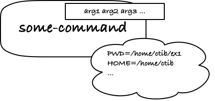

**FIXME: just copied some stuff here that I might need later**

It actually gets a little more. Every process you run has an "environment" where various variables are specified. You can see which variables your shell knows about using the command `env`. Some variables are passed along to the program, to its environment. The process for how that works is not important for us at this point, except that one of the variables is the working directory (`PWD`), so when you run a program, it knows in which directory it is running, so if any of the arguments are relative paths to files, it knows what they are relative to.

While this environment is sometimes important, I don't expect that it will be important in this class, so I will quietly ignore it from here on.
