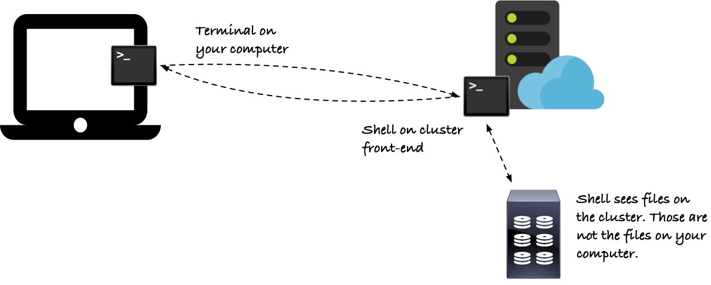
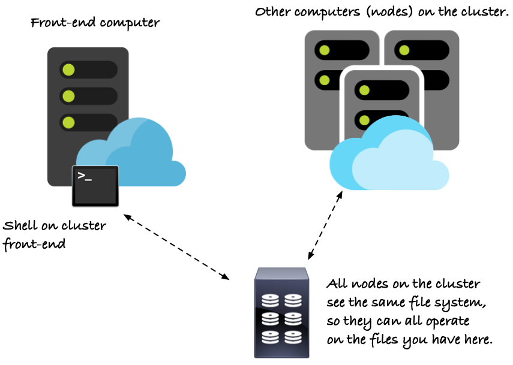
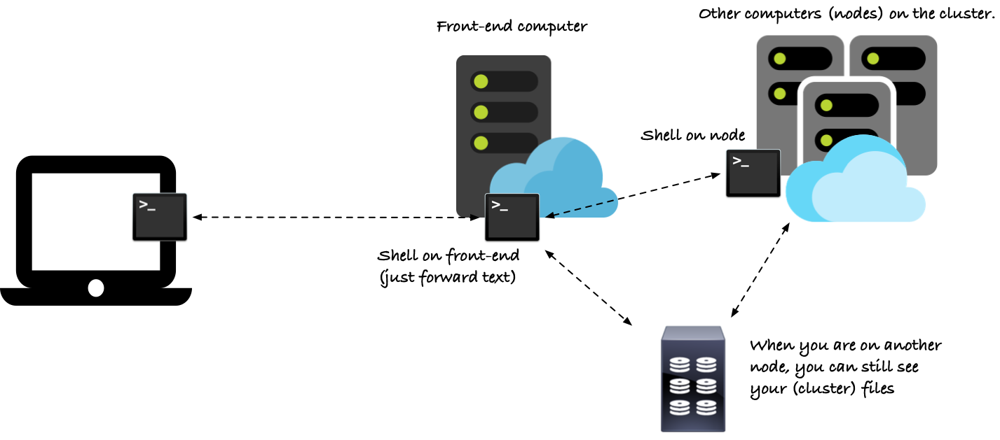

# Cluster architecture

If this is your first trip into a UNIX cluster wonderland, and if you are reading this, it probably is, you should be aware of a few differences between working on your personal computer and working on a system like this. In this note, we will have a look at a few of the differences.

When you log into the cluster, two programs on two distinct computers are in play: the terminal you used to log in, running on your own computer, and the shell, running on the cluster's front-end computer.

Your terminal, and your computer, are not doing much in this interaction. When you type a command in the terminal, it merely sends that command to the shell at the other end, and when the shell reports back what happens, the terminal displays the results. Your computer, your programs, files and directories are not part of the interaction. You cannot access any of your local files from the cluster, and the cluster cannot write files to your computer's disks either. This is not unlike if you had borrowed a friend’s laptop: your files would not be there (unless something dodgy is going on with some severe surveillance). If you want to move data to or from the cluster, you have to do this explicitly, but we will return to this later.

All you have is a terminal that you can use to send commands and see the results, but otherwise, your own computer is not part of the picture.



When you are on the cluster, you have an entirely different file system at your disposal. Most of it you cannot see, though; users are protected from each other, and there are limits to which part of the file system you can access. On the cluster, many projects operate on confidential and restricted data, so the system is set up such that all files are hidden from other users by default, and [you have to set up project directories accessible by multiple users explicitly](https://genome.au.dk/docs/projects-and-accounting) if you plan to collaborate.

At this point, unless you had an account at GenomeDK before the class started, there should be one project folder in your home directory, `birc-hpc`. Well, it isn't quite a directory, but a so-called "soft link" that points to the directory `/projects/birc-hpc/`. Soft links are like short cuts, and the `birc-hpc` in your home directory will work just as a directory in almost all circumstances. An exception is if you want to move it to somewhere else, for example, if you create a subdirectory for your projects

```bash
~> mkdir my-projects
~> mv birc-hpc/ my-projects
mv: cannot move ‘birc-hpc/’ to ‘projects/birc-hpc’: Not a directory
```

This is a quirk of `mv` and soft links. If you leave out the `/` at the end of `birc-hpc/` then it will work.

```bash
~> mv birc-hpc projects/
‘birc-hpc’ -> ‘projects/birc-hpc’
```

You don't need to move the directory if you do not want to. It sits fine where it is for now. But some day you might want to move project directories, so I thought I should tell you about this weird issue.

You use project directories to share data in a group, and we will use `birc-hpc` for that. All members of a group can enter the project directory, so you can share files there. If you have files that you want to put in a project directory, but that you don't want everyone to see, you can always set the permission bits accordingly.

We will also use these groups when we submit jobs to the cluster at large, as it is through these that users are charged for the resources they use. You don't have to use a project to run jobs, but the quota you have as a single user is quite limited, so you generally want to run jobs on a quota where you have more resources (that someone is paying for, so don't go crazy unless you want to hand over your credit card at the end of class).

You can read more about projects [here](https://genome.au.dk/docs/projects-and-accounting/).

Anyway, back on topic. You are sitting at your computer, typing in commands in the terminal; these commands are then sent via `ssh` to the bash shell on the cluster's front end; the shell executes them and then sends the result back. Your computer and terminal are only there to show you what is going on at the other end, and everything that happens when you run programs happens at the cluster's end.

At that end, however, there are more computers than just the front end. A lot more. Which is why clusters are interesting. The front end is a powerful computer, likely much more powerful than your laptop, but alone it couldn't service all the jobs we want to run on the cluster. It doesn't have to, though, and if you treat it right, it shouldn't have to either. Behind the front end is a host of other computers, called *nodes* in cluster-lingo, and those are here to serve your computational needs.

All these nodes *do* have access to the files you can see on the front end (but still not the files on your laptop). The file system on the cluster is shared by all the nodes, and there is no difference between accessing it from the front end or the other nodes.



The front end's only job is to work as an intermediate between you and the cluster proper, and the latter consists of a large array of powerful computers. If you run the command `gnodes` you will get a quick view of what is currently available to you.

```bash
~> gnodes

+- gpu - 36 cores & 384GB & 2 GPUs & max time 7-00:00:00 +
| s10n01  384G  .................................... ** |
| s10n02  256G  ..................................._ *G |
+-------------------------------------------------------+

+- normal - 36 cores & 384GB & max time 7-00:00:00 --+
| s05n01  384G                  DOWN                 |
| s05n02  384G                  DOWN                 |
| s05n03  384G                  DOWN                 |
| s05n04  352G  ....................________________ |
| s05n05  320G  ....________________________________ |
| s05n06  320G  ....________________________________ |
| s05n07  301G  ....__________________OOOOOOOOOOOOOO |
| s05n08  310G  ......_______________OOOOOOOOOOOOOOO |
| s05n09  128G  ..................................!! |
| s05n10  320G  ...........__________________OOOOOOO |
| s05n11  352G  ....................________________ |
| s05n12  320G  ....________________________________ |
| s05n13  370G  .............................OOOOOOO |
| s05n14  304G  ...________________________________O |
| s05n15  244G  ..................................!! |
| s05n16  312G  ...________________________________O |
| s05n17  202G  ...................!!!!!!!!!!!!!!!!! |
| s05n18    0G  _________OOOOOOOOOOOOOOOOOOOOOOOOOOO |
| s05n19  320G  ....________________________________ |
| s05n20  384G                  DOWN                 |
+----------------------------------------------------+

+- normal - 64 cores & 503GB & max time 7-00:00:00 ------------------------------+
| s22n11  463G  .................................................OOOOOOOOOOOOOOO |
| s22n12  439G  ................................________________________________ |
| s22n13  458G  ..............................................________________OO |
| s22n14    0G  ________________________________________________________________ |
| s22n21  311G  ................_______________________________________OOOOOOOOO |
| s22n22  407G  ................_______________________________________________O |
| s22n23  439G  ................................________________________________ |
| s22n24  471G  ................................................________________ |
| s22n31  503G  ................................................................ |
| s22n32  503G  ................................................................ |
| s22n33  407G  ................________________________________________________ |
| s22n34    0G  ________________________________________________________________ |
| s22n41  407G  ................________________________________________________ |
| s22n42    0G  ________________________________________________OOOOOOOOOOOOOOOO |
| s22n43  503G                                DOWN                               |
| s22n44  471G  ................................................________________ |
| s22n51  439G  ................................________________________________ |
| s22n52  439G  ................................________________________________ |
| s22n53  503G  ................................................................ |
+--------------------------------------------------------------------------------+

+- short - 36 cores & 384GB & max time 12:00:00 -----+
| s05n16  312G  ...________________________________O |
| s05n17  202G  ...................!!!!!!!!!!!!!!!!! |
| s05n18    0G  _________OOOOOOOOOOOOOOOOOOOOOOOOOOO |
| s05n19  320G  ....________________________________ |
| s05n20  384G                  DOWN                 |
| s05n21  384G                  DOWN                 |
| s05n22    0G  ___________________________OOOOOOOOO |
| s05n23    0G  ______________________OOOOOOOOOOOOOO |
| s05n24  384G                  DOWN                 |
| s05n25    0G  _______________OOOOOOOOOOOOOOOOOOOOO |
| s05n26    0G  _____________________OOOOOOOOOOOOOOO |
+----------------------------------------------------+

+- short - 64 cores & 503GB & max time 12:00:00 ---------------------------------+
| s21n11    0G  _____________________OOOOOOOOOOOOOOOOOOOOOOOOOOOOOOOOOOOOOOOOOOO |
| s21n12    0G  ______________________________OOOOOOOOOOOOOOOOOOOOOOOOOOOOOOOOOO |
| s21n13  503G                                DOWN                               |
| s21n14    0G  __________________________OOOOOOOOOOOOOOOOOOOOOOOOOOOOOOOOOOOOOO |
| s21n21  503G                                DOWN                               |
| s21n22  375G                                                              OOOO |
| s21n23    0G  _________________________OOOOOOOOOOOOOOOOOOOOOOOOOOOOOOOOOOOOOOO |
| s21n24  479G  ..............................................................OO |
| s21n31    3G  ..............___OOOOOOOOOOOOOOOOOOOOOOOOOOOOOOOOOOOOOOOOOOOOOOO |
| s21n32    0G  _______________________________OOOOOOOOOOOOOOOOOOOOOOOOOOOOOOOOO |
| s21n33    0G  _____________________OOOOOOOOOOOOOOOOOOOOOOOOOOOOOOOOOOOOOOOOOOO |
| s21n34    0G  ___________________________OOOOOOOOOOOOOOOOOOOOOOOOOOOOOOOOOOOOO |
| s21n41    0G  _________________________OOOOOOOOOOOOOOOOOOOOOOOOOOOOOOOOOOOOOOO |
| s21n42    0G  _______________________________OOOOOOOOOOOOOOOOOOOOOOOOOOOOOOOOO |
| s21n43    0G  _____________________________OOOOOOOOOOOOOOOOOOOOOOOOOOOOOOOOOOO |
| s21n44    0G  _____________________________OOOOOOOOOOOOOOOOOOOOOOOOOOOOOOOOOOO |
| s21n51  353G  ..............................................................._ |
| s21n52  500G  ...............................................................O |
| s21n53  503G  ................................................................ |
| s21n54  439G  ............................................................____ |
| s21n61    5G  .....................OOOOOOOOOOOOOOOOOOOOOOOOOOOOOOOOOOOOOOOOOOO |
| s21n62  500G  ...............................................................O |
| s21n63  496G  ..............................................................OO |
| s21n64    0G  ___________________________OOOOOOOOOOOOOOOOOOOOOOOOOOOOOOOOOOOOO |
| s21n71    0G  _________________________________________OOOOOOOOOOOOOOOOOOOOOOO |
| s21n72    0G  ________________________OOOOOOOOOOOOOOOOOOOOOOOOOOOOOOOOOOOOOOOO |
| s21n73    0G  _____________________________________OOOOOOOOOOOOOOOOOOOOOOOOOOO |
| s21n74  503G                                DOWN                               |
| s21n81  503G  ................................................................ |
| s21n82  114G  ..________________________OOOOOOOOOOOOOOOOOOOOOOOOOOOOOOOOOOOOOO |
| s21n83    0G  ___________________________OOOOOOOOOOOOOOOOOOOOOOOOOOOOOOOOOOOOO |
| s21n84    4G  ............______________________________OOOOOOOOOOOOOOOOOOOOOO |
| s21n91    3G  .............________________________OOOOOOOOOOOOOOOOOOOOOOOOOOO |
| s21n92  479G  ..............................................................OO |
| s21n93    0G  ________________________OOOOOOOOOOOOOOOOOOOOOOOOOOOOOOOOOOOOOOOO |
| s21n94    0G  ___________________________OOOOOOOOOOOOOOOOOOOOOOOOOOOOOOOOOOOOO |
+--------------------------------------------------------------------------------+
```

Each box is a so-called *partition*, which is not something we should concern ourselves with. It is mostly just a grouping based on the capabilities of the nodes, and those capabilities are listed at the top of each box.

Inside the partitions, there is one line per node. The first column is the name of the node, the second is the available memory (which is the memory the node has minus what that been allocated by other users), and the final column shows the available CPU cores. Here, the symbols have the following meaning:

| Symbol   | Meaning        |
|----------|----------------|
|      `.` | Available core |
|      `_` | Allocated core |
|      `O` | Loaded core    |
|      `!` | Load is significantly higher than allocated core count |
|      `?` | Load is unknown |

For nodes containing GPUs (something we won't look at in this class), the symbol `*` indicates an unallocated GPU and `G` means an allocated GPU.

We will look at resources (such as computing power or memory) later, but for now, let's take a look at one of the nodes.

First, to avoid having to type in our password every time we want to log into a node, we are going to make a crypto key for our user at the front end. This is just the one you used on your own computer earlier, so answer the questions the same way. We need the new key to get from the front end to a node, while the earlier one was needed to get from our own computer to the front end.

```bash
~> ssh-keygen
Generating public/private rsa key pair.
Enter file in which to save the key (/home/USERNAME/.ssh/id_rsa): 
Enter passphrase (empty for no passphrase):
Enter same passphrase again:
Your identification has been saved in /home/USERNAME/.ssh/id_rsa.
Your public key has been saved in /home/USERNAME/.ssh/id_rsa.pub.
The key fingerprint is:
SHA256:wyOxek7JRL+lqAIaLpsGyit5G1z2Fu6uTSsJym4sEv8 USERNAME@fe-open-01
The key's randomart image is:
+---[RSA 2048]----+
|                 |
|                 |
|      o          |
|     . =         |
|    o = S .      |
|=..o * = *       |
|OBo...@ o        |
|XO+.oX .         |
|@=o+E+*          |
+----[SHA256]-----+
```

After that, we put the key in the file `~/.ssh/authorized_keys` with

```bash
~> cat .ssh/id_rsa.pub >> .ssh/authorized_keys
```

This appends the key to the file that `.ssh` uses to check if we can log in without a password. Since all nodes can read the files we have on the front end (because they are not really sitting on the front end but are shared with the entire cluster), this will tell all the nodes that we are free to log in.

When you are done with this, try this command:

```bash
~> srun --pty /bin/bash
srun: job 9669837 queued and waiting for resources
srun: job 9669837 has been allocated resources
~> hostname
s05n25
```

The numbers will be different from you, and you may have to wait a little bit between being queues and the command moving forward.

The `srun` command is used to send jobs to the cluster nodes, and the job we ask the cluster to run for us is `/bin/bash`. That is the shell that we are running when we are logged into the cluster. The `--pty` option stands for "pseudo terminal"[^ty] and tells `srun` that we want the kind of terminal connection to the new node that we currently have between our own computer and the front end. The result will be that we can run `/bin/bash` on a new that `srun` will allocate for us, and then the front end will work as an intermediate between the terminal we are running on our own computer and the shell that runs on the cluster node.



[^ty]: The `ty` refers to a terminal in much UNIX lingo. It is obviously not short for *terminal*, but stands for *typewriter*, for ancient historical reasons. In days of yore, you had physical hardware terminals, then you got programs that simulated them, called *teletypewriters*, abbreviated `tty`. What we are getting here is a *pseudo* `tty`; or `pty`. Don't think too hard about it.

After the wait, when you get the allocated resource and your prompt returns, you are now communicating with a shell on the new node. Your prompt might reflect this by showing you a different name, but you can also check by running the `hostname` command. If it is one of the nodes, it will have a name like `s05n25`. If you run the command on the front end, you would instead get `fe-open-01`.

You are welcome to explore the node a bit, but you will find that it doesn't look that different from the front end. This is intentional. The shared file system greatly simplifies working with jobs on the cluster, by making each node look much like any other, so when you start a job on the cluster you usually don't have to worry about which environment it will run in.

When you grow tired of playing on the new node, type `exit` or press `Ctrl-D` to log out. You will then be sent back to the front end, where I will leave you for now.
