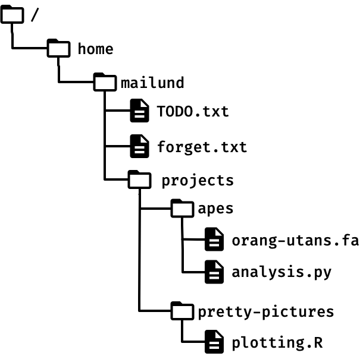
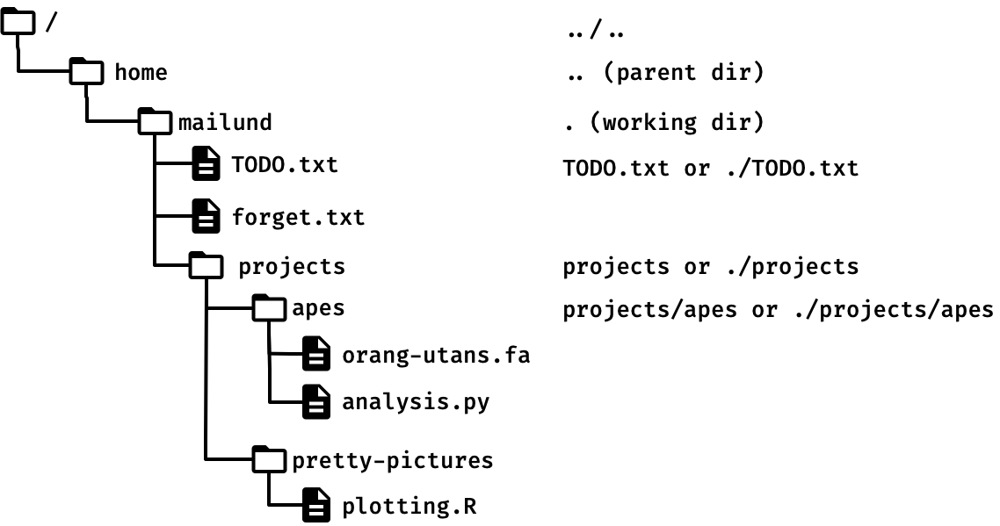
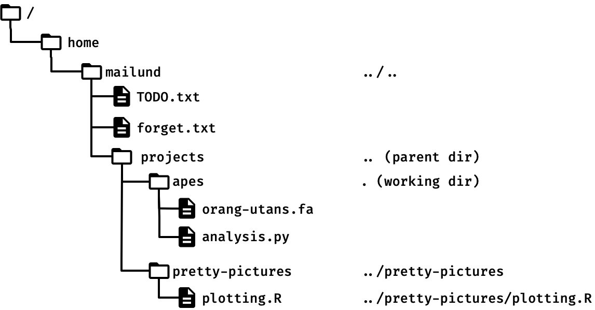

# Navigating the file system

You should already be familiar with the typical way of structuring files and folders on a computer. Even if your only experience with computers is with smartphones or tablets, you know that we organise data in files and folders in a hierarchical way: folders can hold files or other folders that, in turn, holds other files or folders.



Folders are called *directories* in UNIX, but otherwise, there should not be anything surprising here. Of course, if you work in a textual interface like a shell, then you cannot click you way through files and folders, so you need a way to refer to these, and the rule is that you list the "path" to a file or folder as a list of directory names separated by a slash, `/`, followed a final slash and the file or folder you are referring to. The topmost directory is named `/` (called *root*), and you start there. So to get to the `TODO.txt` file in the figure above, you would write:

```bash
/home/mailund/TODO.txt
```

To refer to the `orang-utans.fa` file in the `apes` folder, you would write

```bash
/home/mailund/projects/apes/orang-utans.fa
```

With deeply nested directories, writing such paths becomes tedious, so UNIX also has a concept of *relative paths.* The idea is that you are always positioned somewhere in the directory hierarchy, whether "you" here is where your shell is currently sitting or where a program is running. This position is called the *working directory*, and if you are in your shell you can ask it to print where its is using the command `pwd`.

```bash
~> pwd
/home/mailund
```

You can also get the location from the variable `PWD`[^pwd]

```bash
~> echo $PWD
/home/mailund
```

[^pwd]: `pwd` stands for “Pathname of the current Working Directory”, not “Print the current Working Directory”. The command `pwd` does print the working directory, but the variable `PWD` (uppercase) doesn't print anything. It is just the name of the current directory.

You can refer to files and folders relative to the working directory by leaving out the `/` at the beginning of a path. The `/` makes the path relative to the root directory, `/`, you could say, and anything that isn't relative to that is relative to your working directory.

Let's say that our working directory is `/home/mailund` (as `pwd` informed us above). Then to get at the `orang-utans.fa` file, we do not need to write the absolute path

```bash
/home/mailund/projects/apes/orang-utans.fa
```

but we can star at `/home/mailund` and write, instead, simply

```bash
projects/apes/orang-utans.fa
```

The working directory also has a symbol in the path notation, and it is `.` (dot/full stop). This symbol refers to the current directory, and we can start paths there as well. The relative path above could thus also be written as

```bash
./projects/apes/orang-utans.fa
```

where we are explicitly starting in the working directory, rather than just doing it implicitly by leaving out `/`.

There is also a way to refer to enclosing directories using relative paths. If we want to refer to `/home` from `/home/mailund` we could, of course, just write `/home`, but in UNIX two dots, `..`, refers to the parent directory, so from `/home/mailund`, `..` refers to `/home`.

You can use `..` as part of a longer path, where it always means the parent of the directory you have gotten to so far. So, if you want the parent of the parent of the working directory, you can get to the parent with `..` and then continue with `../..` to get the grandparent.



Or, if your working directory was `/home/mailund/projects/apes`, you could use `../..` to refer to `/home/mailund` and `../../..` to refer to `/home`.

If you go up the hierarchy you can also go down again, to the same or a different directory from where you came. You just need to continue the path from the `..` that took you up. From `/home/mailund/projects/apes` we could go to the `plotting.R` file using

```bash
../pretty-pictures/plotting.R
```

The `..` takes us up to the `projects` directory, then the `../pretty-pictures` takes us into the `pretty-pictures` directory where we pick up the `plotting.R` file.



Try running these commands and see what you get:

```bash
~> ls .
~> ls ..
```

It should show you a listing of the files in the current working directory and in the parent. The first is equivalent to writing `ls`, since `ls` will list the working directory if you do not give it another argument.

We have already used relative paths copiously in the previous notes. When we wrote `cat qux`, we used a relative path. Since we didn't give an absolute path for `qux` (the path didn't start with `/`), we found the `qux` in the working directory. Earlier, when we did `touch foo/bar`, we also used a relative path. We specified the directory `foo` in the current directory and then the file `bar` inside that `foo` directory.

The two dots can be used inside a path, so if we wrote:

```bash
~> mkdir foo
~> ls foo/..
```

we would ask `ls` to list the parent directory of `foo` (which would be the same as the current directory.

To change directories, you use the command `cd`. It takes a path as an argument, so you can change the current directory to the sub-directory `foo` using:

```bash
~> cd foo
```

Then you can go back to the original directory with

```bash
~> cd ..
```

You sometimes jump far away with a `cd` command, and then, quite frequently, you want to go back to where you came from. Using `..` only works if you went into an immediate nested directory and want to go out again, but not if you jumped somewhere else complete.

```bash
~> pwd
/home/mailund
~> cd ./projects/projects/apes
~> pwd
/home/mailund/projects/apes
~> cd ..
/home/mailund/projects
```

Here, `cd` has another shortcut. If you do `cd -` you will jump back to where you were before the most recent `cd`:

```bash
~> pwd
/home/mailund
~> cd ./projects/projects/apes
~> pwd
/home/mailund/projects/apes
~> cd -
/home/mailund
```

Some shell setups have more elaborate ways of keeping track of recent working directories, but in my experience, the simple `cd -` handles 99% of the cases I ever need.

If you use `cd` with arguments, you will be sent to your home directory, whatever that is. It depends on your platform, and it isn’t an important concept on a personal computer, but it is if you have an account on a shared system like our GenomeDK cluster. The home directory is the root of all your files, kept separated from other users’ files.

You can find your home directory by jumping there with `cd` and running `pwd` (and then you can always jump back with `cd -`), but you can also find it in the variable `HOME`

```bash
~> echo $HOME
/home/mailund
```

The home directory is so important that it has its own symbol in the path descriptions. When you write a path, `~` refers to your home.

If my home directory is `/home/mailund`, then `~/projects/apes/analysis.py` refers to `/home/mailund/projects/apes/analysis.py` regardless of where my working directory is currently at.

Try using `cd` to move around the directory hierarchy, and every time you end up somewhere new, use `pwd` to see where the shell thinks you are.
