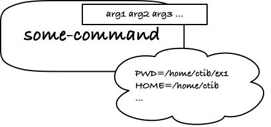

# Scripts and variables

A toolbox of commands, and familiarity with how to string them together in pipelines, is the bread and butter of day-to-day interaction with the UNIX system, but it has its limitations.

Sometimes, you have a series of commands you want to execute frequently. Imagine, for example, that you regularly have to collect current results and send them to collaborators.

Let's further imagine that you have a file, `important.txt`, containing the files you need to send each time. It could look something like this:

```txt
analysis1/results.txt
analysis2/experiments-1.txt
analysis2/experiments-2.txt
```

When you need to send the files, you want to zip them up so you can email them, you want to tag them with the date where you sent them (because your collaborators are forgetful and will mix them up otherwise), and you want to make a backup so no one can claim that you sent them the wrong files, or out of date files.

## Manually backing up important files

First, let's figure out how to get the current date. The command `date` sounds like something we can use, and indeed we can.

```bash
~> date
Tue Oct 18 12:14:19 CEST 2022
```

It is just not in a handy format if we want to add a date to a file name. But the command takes various arguments for formatting the date, and if we use `+%F` we get `YYYY-MM-DD` which is good for sorting files (it will sort lexicographically, matching how we would sort dates).

```bash
~> date
2022-10-18
```

We can use this to make a directory to collect the data in:

```bash
~> mkdir results-$( date +%F )
```

The syntax `$( ... )` tells bash to run a command, here `date +%F`, and paste the output of this command to replace the `$( ... )` bit. So, since `date +%F` outputs `2022-10-18`, the text `results-$( date +%F )` becomes `results-2022-10-18`, and this will be our results directory.

We want to copy the important files there, and for that we can use

```bash
~> cp $( cat important.txt ) results-$( date +%F )
```

We are using the `$( ... )` syntax again, first to get the file names from `important.txt` and secondly to get our target directory.

If you find this `$( ... )` stuff confusing, try using `echo` to see what it expands to:

```bash
~> echo cp $( cat important.txt ) results-$( date +%F )
cp analysis1/results.txt analysis2/experiments-1.txt analysis2/experiments-2.txt results-2022-10-18
```

Everything is as it should be.

Ok, so now we have the files in `results-2022-10-18` so we can zip them up. The UNIX way is to combine two commands, `tar` and `gzip`, so you get a `.tar.gz` file, but you can run both using just the `tar` tool:

```bash
~> tar -czf results-$( date +%F ).tar.gz results-$( date +%F )
```

The options are *c*reate, *z*ip, *f*ile (where the latter means you are giving the result a file name). The file name we give is `results-$( date +%F )` which will expand to `results-2022-10-18`.

If you want to unpack the files later (and you probably want to if it is worth packing them), then the command is `tar` again, but with options `-xf` for e*x*tract and *f*ile

```bash
~> tar -xf results-2022-10-18.tar.gz
```

Ok, now we have our files wrapped up and zipped (in what is affectionally called a *tarball*), and we can copy it to some backup place.

```bash
~> cp results-$( date +%F ).tar.gz backup
```

Then we can clean up after ourselves.

```bash
~> rm -r results-$( date +%F )
```

This just removes the directory we made, but it leaves the `results-2022-10-18.tar.gz` file alone so you can send it to the collaborators who are anxiously awaiting your latest results.

You can even mail it from the command line (but I won't show you how, as you might get in trouble with automated mailing, and in any case, you won't be able to do it from the cluster).

Summarising all of this, the commands looked like this:

```bash
~> mkdir results-$( date +%F )
~> cp $( cat important.txt ) results-$( date +%F )
~> tar -czf results-$( date +%F ).tar.gz results-$( date +%F )
~> rm -r results-$( date +%F )
~> cp results-$( date +%F ).tar.gz backup
```

It is nothing complicated, but it is not something you want to remember either, and if it is something you need to do every week, it is rather cumbersome and error-prone. It would probably take just as long the second, third, or maybe even tenth time as it did the first time.

But you don't have to. It is quite easy to turn this sequence of commands into a single one, and we can fix some potential error sources simultaneously.

## Writing your first shell script

Take the commands from above, and put them in a file. I will call it `backup.sh`. I call it `backup` because that is what the commands are doing, and `.sh` reminds me that these are shell commands. UNIX doesn't care what we name our files, but the convention is that a file that ends in `.sh` will contain shell commands of some sort, and your editor will use that to determine how it should display the file's content.

So, my `backup.sh` looks like this:

```bash
mkdir results-$( date +%F )
cp $( cat important.txt ) results-$( date +%F )
tar -czf results-$( date +%F ).tar.gz results-$( date +%F )
rm -r results-$( date +%F )/*
cp results-$( date +%F ).tar.gz backup
```

Nothing fancy here; I just put the commands in a file. From here, I could simply copy and paste every time I needed to run them, but there is an even easier way: I can *source* the file.

```bash
~> source backup.sh
analysis1/results.txt -> results-2022-10-18/results.txt
analysis2/experiments-1.txt -> results-2022-10-18/experiments-1.txt
analysis2/experiments-2.txt -> results-2022-10-18/experiments-2.txt
results-2022-10-18.tar.gz -> backup/results-2022-10-18.tar.gz
```

The `source` command will run all the shell commands in your file, just as if you had pasted them in. You might also sometimes see

```bash
~> . backup.sh
analysis1/results.txt -> results-2022-10-18/results.txt
analysis2/experiments-1.txt -> results-2022-10-18/experiments-1.txt
analysis2/experiments-2.txt -> results-2022-10-18/experiments-2.txt
results-2022-10-18.tar.gz -> backup/results-2022-10-18.tar.gz
```

When you use dot `.` as a command, it means the same as `source`. Generally, people who use UNIX are lazy, so we pick short names when we can get away with it. The thought is, I think, that it is easier to think for an hour about what the command is called than it is to type a slightly longer but meaningful name. I don't know. Don't blame me, I didn't write UNIX.

Anyway, that is one easy way to run a sequence of commands: put them in a file and source them.

Sourcing commands isn't always ideal, though. When you do it, all the commands are run in your current shell, just as if you had typed them in yourself, but the commands might jump around the file system using `cd`, leaving you somewhere unexpected afterwards, or they might change your prompt or the colour of your shell's text, and generally all kinds of things you don't want to happen in the shell where you are currently working.

Instead, you can run the commands in a completely fresh shell. Just use the `bash` command to start a new `bash` and run the commands there.

```bash
~> bash backup.sh
```

With this approach, your commands are run in a fresh shell, so they won't be affected by the shenanigans you have been up to in the shell so far. Likewise, what happens in the new shell stays in the new shell.

There are pros and cons to both approaches. You *do* want to source if you need to affect your current shell, so sometimes that is what you want. Most of the time, though, you just want to execute your commands, and you don’t want your setup to have changed when you are done.

There is a third variation—that basically does the same as calling `bash` with your file of commands—is to turn the file into an executable itself. This has some extra benefits compared to just calling `bash`, predominantly that it will behave just as any other executable, and we won’t have to distinguish between a list of commands we have written ourselves and any other command we might run.

We need to do two things to achieve this:

- We need to inform UNIX about how it should execute our file, and
- we need to give UNIX permission to run the file.

First things first: how does UNIX figure out how to run a command? There are essentially two ways to execute a command. The command could be a file containing machine code, and if that is the case, UNIX will run it directly on the hardware. Alternatively, the file could contain commands for another program, like the shell, that tells that command what to do. We are in the second category. The shell program, `bash`, is machine code, and it can run directly on the computer, but what we have here is a list of commands that we need `bash` to interpret and execute.

When we are in the second category, we need to tell UNIX which program should interpret our instructions, and we do this by writing a special command at the first line of the instructions file. We will write

```bash
#!/bin/bash
```

The `#!` as the first two characters informs UNIX that we are giving it the path to a command we want to deal with the rest of the file, and the rest of the line is the command UNIX should run. When it sees this, it will run the command we give it, providing the file we are running as its standard input.

So, update `backup.sh` to this:

```bash
#!/bin/bash

mkdir results-$( date +%F )
cp $( cat important.txt ) results-$( date +%F )
tar -czf results-$( date +%F ).tar.gz results-$( date +%F )
rm -r results-$( date +%F )
cp results-$( date +%F ).tar.gz backup
```

Now, if we manage to execute the file (and we will shortly), UNIX will run the command `/bin/bash` and give it

```bash
#!/bin/bash

mkdir results-$( date +%F )
cp $( cat important.txt ) results-$( date +%F )
tar -czf results-$( date +%F ).tar.gz results-$( date +%F )
rm -r results-$( date +%F )
cp results-$( date +%F ).tar.gz backup
```

as input.

Notice that the tool also gets the `#!/bin/bash` line (also called the “hash-bang” line since `#` is pronounced “hash” in UNIX and `!` is pronounced “bang”). The shell won’t do anything about that line, though, since `bash` considers anything that follows a `#` a comment that it should ignore. Lucky us. Well, it isn’t *pure* luck, and you will learn that most UNIX tools consider `#` the start of a comment, and they do that because they want to ignore hash-bang lines. But I digress…

If we wanted to run a Python script instead, the hash-bang line might look like this instead:

```python
#!/usr/bin/python3

print("Hello from Python")
```

(assuming the `python3` executable is in `/usr/bin`). From `R` we might have

```r
#!/usr/local/bin/R

print("Hello from R)
```

(assuming R is in `/usr/local/bin`). It is the same rule everywhere, regardless of which scripting language you are using. Try it out, if you have a program written in another language of this type.

Getting back to our script, which is what such files of commands are called in the UNIX world. If you try to run it as a normal command, you will be disappointed.

```bash
~> backup.sh
bash: backup.sh: command not found
```

Why can’t bash find it? It is right *there*! `ls` will back me up on that!

The thing is, when the shell is looking for commands, it doesn’t just pick the first file with the right name that it can find. That could end up getting messy. Instead, it looks for commands in a selected number of places, and if you want to know where, check the variable `$PATH`.

```bash
~> echo $PATH
~/go/bin:/Library/Frameworks/Python.framework/Versions/3.10/bin:/usr/local/bin:/usr/bin:/bin:/usr/sbin:/sbin:/Library/Apple/usr/bin:/usr/local/go/bin:/Library/TeX/texbin:/Users/mailund/go/bin/
```

(these are the results I get on my iMac, and yours will differ depending on how your shell is set up).

It is a list of `:`-separated directories, and unless the executable is in one of those, UNIX doesn’t find it. If you want to run your script as a command, you either need it to be in one of the `PATH` directories or you have to provide a path to it.

The first option means you either copy the file to the desired directory, or you have to add a directory to `PATH`. The current directory is `.`, so you could add `.` to `PATH`.

```bash
~> PATH=.:$PATH
```

This updates `PATH` to `.` followed by the old list (in `$PATH`). If you do this, then UNIX will always prefer to run files in your current directory over files in the other `PATH` directories. I suggest you do not do this. You don’t want to run random files you just happen to have where you currently are. But there is nothing wrong with making a new directory, say `~/bin`, where you put scripts you use often, and then adding `~/bin` to `PATH`. If you do, though, you want to update `PATH` every time you log in. You can do that by editing **FIXME: where is `.bashrc` or its equivalence on the cluster?

For a script that is supposed to be run in this particular project’s directory and nowhere else—we are backing up specific files that are only found here, after all—we don’t want to make it a command we can run from anywhere. Instead of getting the script into `PATH` we can use a path to it when we want to run it.

```bash
~> ./backup.sh
bash: ./backup.sh: Permission denied
```

When we specify which path the file is in, `./` is the current directory, UNIX finds it. It just refuses to execute it.

There is a simple file permission system on UNIX that specifies who is allowed to read, write, and execute files. You can see how those permissions are set with `ls -l`:

```bash
~> ls -l
total 88
...
-rw-r--r--  1 mailund  staff    216 Oct 18 13:20 backup.sh
...
```

It is the string `-rw-r--r--` you are interested in now. The first character will be `d` if you are looking at a directory, and `-` otherwise. It is not interesting right now. The remaining nine characters show the status of three groups of permissions.

The world, according to UNIX, is separated into three layers of people. The owner of a file, also known as the user (here it is `mailund`), the group the file (and usually owner) belongs to, here `staff`, and then everybody else. For each layer, there are three “permission bits”: read, write, and execute. The string `-rw-r--r--` says that the owner (the first three bits after the directory indicator) can read, (`r`), can write (`w`), but cannot execute, (`-`). Members of the group can read but not write or execute (`r--`), and the same for everybody else (`r--`).

The command `chmod` (change mode) can change the bits (if you have permission to change them, which you have if you own the file, i.e., it considers you the user).

To set the execute bit for myself, I can write:

```bash
~> chmod u+x backup.sh
~> ls -l
...
-rwxr--r--  1 mailund  staff    216 Oct 18 13:20 backup.sh
...
```

Notice that the user bits went from `rw-` to `rwx`. The group and “other” permission didn’t change and is still `r--`.

The `u` in the argument to `chmod` specifies that we are changing permission for the user and the `+x` specifies that we are turning execution permission on. If you try the command with `u-x` instead, you will turn the execution bit off.

To change permission for the group, you use `g` instead of `u`, and if you want to change it for others, you use `o`. If you want to change a bit for all three layers, you can use `a`.

```bash
~> chmod a+x backup.sh
~> ls -l
...
-rwxr-xr-x  1 mailund  staff    216 Oct 18 13:20 backup.sh
...
```

Generally, you shouldn’t increase permissions for everyone worldwide, but the `a` option is safe if you want to reduce permissions.

This `backup.sh` script is probably not one you intend for anyone but yourself to use, so just use `chmod u+x backup.sh` and leave it at that.

If you have done that, UNIX has permission to execute the file, and since we have a hash-bang line (`#!/bin/bash`), it knows how to.

```bash
~> ./backup.sh
```

## Cleaning up the script using a variable

Let’s have a look at the script again:

```bash
#!/bin/bash

mkdir results-$( date +%F )
cp $( cat important.txt ) results-$( date +%F )
tar -czf results-$( date +%F ).tar.gz results-$( date +%F )
rm -r results-$( date +%F )
cp results-$( date +%F ).tar.gz backup
```

We have `$( date +%F )` a lot in there… is that safe? Well, if we are careful not to use another date format accidentally, they should all evaluate to the same string. Unless you run the script around midnight, then it will change halfway through. And it will definitely break sooner or later if you want to include the clock in the format.

```bash
~> date +%F-%H-%M
2022-10-18-14-00
```

Can we fix this so we only generate the string once and then reuse it elsewhere? Of course, we can! We’re script kiddies now.

If you do this, the result of the `date` command is written to the *variable* date

```bash
~> date=$( date +%F-%H-%M )
~> echo $date
2022-10-18-14-02
```

The `date` command is run as in our script, and using `$( … )`, we get the output. When we assign the result to the variable `date`:

```bash
date=$( date +%F-%H-%M )
```

we create a new variable, `date`, and we can get its value with `$date`. It won’t interfere with the `date` command, don’t worry about that. If we write `date`, it is the command, but if we put a dollar in front of it, `$date`, it is the value in the variable.

We can use this in our script to avoid calling the `date` command more than once:

```bash
#!/bin/bash

# Get the current date
date=$( date +%F )

# Collect files, zip them up, and save a backup
mkdir results-$date
cp $( cat important.txt ) results-$date
tar -czf results-$date.tar.gz results-$date
rm -r results-$date
cp results-$date.tar.gz backup
```

We get the `date` string at the top of the string with:

```bash
date=$( date +%F )
```

Everywhere else, we use `$date` to get the string without rerunning the command.

Notice that I have also added some comments. We might as well exploit that bash won’t execute whatever we write after a `#`.

Incidentally, this variable can show you one of the differences between sourcing and running a script in a new shell (as a `#!`-script or by calling `bash` with it as its argument).

Get rid of the variable if you have accidentally set it

```bash
~> unset date
```

Now run the script in its own shell, and check if you have something in the variable:

```bash
~> ./backup.sh
~> echo $date

```

Nope, it is empty. Try with sourcing the file instead:

```bash
~> source backup.sh
~> echo $date
2022-10-18
```

This time it is here!

The variables we set in a shell are local to it. If we source, we run the commands in our current shell, so the variables we set will remain set after the script is done. If we run the file as a script, however, it runs in another shell, and what variables are set there will not affect the shell we are interacting with right now.

There is a twist to that, called *environment variables*, but we return to those later in this note.

## Working with variables and script arguments

Generally, the way you use variables is that you can *set* them:

```bash
~> var=value
```

Once set, you can get the value they contain:

```bash
~> echo $var
```

The variables are textual, and if you are familiar with other programming languages, that can get confusing. Arithmetic expressions and such might not work the way you expect.

```bash
~> x=2
~> echo $x + $x
2 + 2
```

If you expected two plus two to equal four here, that is the confusion I am talking about. The variable `x` contains the *string* `2`, and when we get its value, we are just getting the text.

There are ways to evaluate expressions, but they are a topic for another note. For now, just keep in mind that variables generally contain text, and when you extract values, you are doing text substitution.

There are [a lot of complicated rules](https://www.gnu.org/software/bash/manual/bash.html#Shell-Parameter-Expansion) for modifying how a variable is expanded, but you don't use them often, so don't bother memorising them. If you need something, google it, and work it out from there. If you try to learn the rules now, chances are that you will never ever need it, so that will be a waste of time.

However, one you will definitely run into looks like this: `${var}`.

Here, the variable is in curly brackets. The various expansion rules will look like that. This one, however, is simple. If you put the variable name in curly brackets, it expands to the same as if you didn't.

```bash
~> var=hello
~> echo $var ${var}
hello hello
```

If the curly brackets don't do anything, why use them? Well, it is handy if you want to expand a variable inside a text like this:

```bash
~> x=foo
~> echo "First: '$xbar', second '${x}bar'"
First: '', second 'foobar'
```

The string `$xbar` refers to the variable `xbar`, which doesn't exist and thus is expanded to an empty string. On the other hand, the string `${x}bar` refers to the variable `x` and then the string `bar`, and when `x` is expanded, we get `foobar`.

If you need a variable inside some text, such that the whole string could be confused for a variable name, then use `${...}`.

If you now get the idea that you can put variables in quoted strings, you are correct with one caveat. If the string is quoted with double quotes, the variable will be expanded.

```bash
~> echo "Hello $x"
Hello foo
```

In single quotes, however, it won't, and you get the literal string you put in the quotes, reference to the variable and all.

```bash
~> echo 'Hello $x'
Hello $x
```

Bash will generally treat the two kinds of strings differently, something that may surprise you if you are familiar with a language like Python (but if you are familiar with something like Tcl, you will find bash much simpler and more straightforward...just saying).

Another handy expansion looks like this:

```bash
~> echo ${x:-bar}
foo
~> unset x  # remove the variable x
~> echo ${x:-bar}
bar
```

The syntax `${var:-default}` will give you the value of `var` if the variable exists, and otherwise it will give you what comes after `:-`.

It is a terrible uninformative syntax, I agree, but most of the rules for expansion are.

It is particularly handy to have defaults for variables if you want your script to take arguments.

But how does arguments work with a shell script? I hear you ask (in my imagination).

Any UNIX process has a list of arguments, from one and up. Not zero, but one, because UNIX considers the name of the program you run the first argument. Arguments are indexed from zero, so the real arguments start at index 1.


How different languages deal with arguments can vary, but bash was built for UNIX, and it has the same philosophy. When you are running a shell script, the variable `$0` will hold the script’s name, `$1` is the first argument you gave the script, `$2` is the second, and so on. In addition, if you want an expansion of *all* the arguments (excluding the script name), you can use `$@`, and if you want the number of arguments (also excluding the script name), you can use `$#`. Try it with this script (and remember to give it execution permission):[^1]

[^1]: The `\"...\"` might look odd, but this is what it is doing: I wanted to put the list of arguments in quotes. If I just use `"..."` I get a string containing the list of arguments, and that would expand to just the arguments. I would lose the quotes. But by *escaping* the quotes with a backslash, I tell bash to use the literal symbol, so it will include the two quotes in the output instead of trying to be clever about it and interpret it as a string.

```bash
#!/bin/bash

echo All $# arguments: \"$@\"
echo The script is named $0
echo Argument 1: $1
echo Argument 2: $2
echo Argument 3: $2
```

The `$@` and `$#` variables have horrible names. I don't know why shell people insist on using what looks like line noise for variables, but they do. It is what it is, though. At least it is reasonably easy to remember the positional arguments.

Let's try to add arguments to our backup script. Maybe we have decided that we want to use it in other projects, so we want to add an option for where the script should run, where the file that contains the list of other files to back up is, and where the backup directory is. We still want to be able to run the script without arguments as before, so we add default arguments to all the options. That could look like this:

```bash
#!/bin/bash

# Variable $1 is the first argument. If it isn't set,
# we will use the working directory (which we get from $PWD)
work_dir=${1:-${PWD}}

# Variable $2 is the second argument. If it isn't set,
# we use 'important.txt' as default.
important_file=${2:-important.txt}

# Variable $3 is the tird argument. If it isn't set,
# we use 'backup' as default.
backup=${3:-backup}


# Get the current date
date=$( date +%F )

# Collect files, zip them up, and save a backup
mkdir results-$date
cp $( cat $important_file ) results-$date
tar -czf results-$date.tar.gz results-$date
rm -r results-$date
mkdir -p $backup && cp results-$date.tar.gz $backup
```

We use variables `$1`, `$2`, and `$3` to specify the working directly, the "important file”, and the backup directory, and for all three, if they are not set (which happens if the user provided fewer arguments than we expected), we use a default.

One way to deal with this is to have optional arguments, similar to the options you have seen in many commands so far. Unfortunately, this is unusually ugly to get in bash, so the next step will be quite a mouthful. Mainly because I see it as an excuse to throw in a lot of other new stuff...

## Parsing options, functions, and miscellaneous other stuff

We are going to update our script, so it takes optional arguments for specifying the directory to work in, the “important files file”, and the backup directory. Knowing that we are a forgetful bunch, we probably need to be reminded of which arguments the script takes, so we also want it to give us a helpful error message if we mess it up and maybe an even more helpful message if we explicitly ask for help.

If we give the script an option it doesn’t know about, we want this to happen:

```bash
~> ./backup.sh -x
./backup.sh: illegal option -- x
Usage: ./backup.sh
          -h              display help
          -d directory    set working directory
          -i file         file containing files to backup
          -b directory    where to backup
```

If we give it the option `-h` we want a longer message:

```bash
~> ./backup.sh -h
Tool for backing up important files.

Will create a tarbal with important files, with a date stamp,
and copy it to a directory of your choice.

    -d directory
    Set in which directory to run

    -i file
    Specify in which file we can get the list of what
    to back up.

    -b directory
    Specify in which directory we should place the backup
```

Ok, maybe it is not the best prose you have ever read, but I didn’t study English, so shut up. You can write your own messages once the lesson is over.

To do that, you will need to update this bit of the new script:

```bash
# Function for showing usage
function usage() {
    echo "Usage: $0
          -h              display help
          -d directory    set working directory
          -i file         file containing files to backup
          -b directory    where to backup
    "
    exit
}

# Function for showing help (shorter usage)
help() {
    echo "Tool for backing up important files.

Will create a tarbal with important files, with a date stamp,
and copy it to a directory of your choice.
    
    -d directory
    Set in which directory to run
    
    -i file
    Specify in which file we can get the list of what
    to back up.
    
    -b directory
    Specify in which directory we should place the backup
    "
    exit
}
```

These are two *functions*: `usage` and `help`. Functions are another way to add commands to bash, and they are not entirely unlike scripts. You write a function name, parentheses, and then in curly brackets, the commands you want to run when you use the function as a command.

We defined

```bash
function usage() {
 ...
}

help() {
 ...
}
```

and you might wonder why it says `function` before `usage` and not before `help`. Because I could show you that `function` is optional, that’s why. You can add it, if you want to make it explicit that you are defining a function, or you can leave it out if you don’t care.

Inside the function are the commands we want the functions to run, and there is nothing new in how that works. We use the `echo` command to write a message, and you have seen that one many times before. Then we use the `exit` command to terminate. This command will terminate the current shell (so don’t write it in your current shell), which for shell scripts means that it will terminate the entire script. That is exactly what we want here. There are other ways to leave a function that doesn’t involve shutting down the entire script, but that is a topic for another day.

If you want to run `usage`, just invoke it as a command

```bash
~> usage
```

It won’t work unless you have defined it in your current shell, and if you run it, it will close the shell, so don’t do that. Try starting a new shell, paste the function definition in, and then run it.

```bash
~> bash  # starts a new shell. When it closes you go back here
~> usage() {
...
~> }
~> usage # run this to see what happens
```

Ok, those were the messages. Now comes the ugly part—we need to parse the options.

Bash has a command called `getopts` that can do this for us. There is another command, called `getopt`, that does the same but in a completely different way, so make sure you use the one that ends in ’s’, or the following won’t work (but you might learn how to use the other one if you try).

The option parsing looks like this:

```bash
while getopts hd:i:b: flag; do # get one option at a time
    case $flag in
        h) # -h flag
            help  # Display help message and exit
            ;;

        d) # -d flag
            dir=$OPTARG
            ;;

        i) # -i flag
            important_file=$OPTARG 
            ;;

        b) # -b flag
            backup=$OPTARG
            ;;

        ?) # anything else
            usage  # is an error, so show usage and stop
            ;;
    esac # end of case
done
```

If you don’t understand a word of this, don’t worry. We will see more of these kinds of things in a later session. For now, I will try to give a brief explanation.

The `getopts` command takes two options, `hd:i:b:` and `flag`. The latter is just the name of a variable we want it to write the option into. When it sees a flag such as `-h`, it will write it into `flag`, and we can get it as `$flag`. The `hd:i:b:` looks weirder, but it is just a list of the options we want it to handle.

The `getopts` command can only handle single-letter flags, så things like `-h` or `-d`, but not long flags such as `--help` or `--directory`. If you want that, you need `getopt`, or you need a hack that you can learn at a later point. So the format for option specification is a sequence of letters, `hdib`. The colons you add when you want a flag to take an argument. For `-d`, `-i`, and `-b`, we want an argument—a directory, file, and directory, respectively—so we put `:` after those.

When we call `getopts hd:i:b: flag`, it will parse the script arguments, figure out what the first flag is, and put it in `flag`. It then terminates with the status `0` to indicate that it managed to parse one option. If there are no more options, it will return a non-zero status. The `while` loop works by repeatedly executing the command until the status is non-zero, so combining these two we get that

```bash
while getopts hd:i:b: flag; do # get one option at a time
    ...
done
```

will run as long as `getopts` can find flags. For each flag, the stuff between `while` and `done` is executed.

Inside the `while` loop we use a `case` on `$flag`.

```bash
    case $flag in
   ...
    esac # end of case
```

This construction will test the value in `$flag` against various options. Each option looks like

```bash
        something-to-match)
            Something to do when we match.
            This will be the commands we want
            to run.
            ;;  # <- ;; means the end of the case
```

The `case` construction will compare the flag against whatever is in the `something-to-match` fields, the stuff to the left of `)`, and if it finds a match it will run the stuff following the `)` and forward to `;;`. We have put the options we recognise as different fields.

If we see the flag `-h`, then `$flag` will be set to `h` (without the dash), so we can match on that and print help (by invoking the `help` function):

```bash
        h) # -h flag
            help  # Display help message and exit
            ;;
```

For the other flags, we set a variable to the flag’s argument. That argument will be in the variable `$OPTARG`. This variable is automatically set by `getopts`.

```bash
        d) # -d flag
            dir=$OPTARG
            ;;

        i) # -i flag
            important_file=$OPTARG 
            ;;

        b) # -b flag
            backup=$OPTARG
            ;;
```

If there is an error, for example, if we use an unknown flag like `-x`, or we forget to add a required argument `./backup.sh -d`, then `getopts` will set `flags` to `?`, and we can match on that to provide an error message and exit.[^2]

```bash
        ?) # errors
            usage  # is an error, so show usage and stop
            ;;
```

[^2]: Okay, I am lying here. It is true that `getopts` will set `$flag` to `?` and that we are matching `?`, but there is more to it. If you use `?` as a matching pattern, you will match *any* single character. So we match `?` but we would also match anything else that isn’t caught by the other cases. If you don’t believe me, move the `?` case up to the top. It will match every time. But we catch the known flags first, so it doesn’t matter if the `?` case matches more than it should. If you want to match *only* `?` you have to escape it by putting a backslash in front of it: `\?)`. That way, you will match the literal question mark, rather than any single character. If you are wondering if there are other such special match characters,  you should know by now that in bash, [there is always more](https://www.gnu.org/software/bash/manual/html_node/Pattern-Matching.html#Pattern-Matching). The matching you are doing here is the kind of glob-matching you can do on file names with `ls`.

All this might look a bit complicated, but don’t sweat it. It can and will get much, much worse.

Anyway, I hope it makes sort of sense now.

If we make it past the option parsing, we have set variables according to the arguments. We then want to use defaults for those variables we didn’t get arguments, but we already know how to do that:

```bash
dir=${dir:-$PWD}
important_file=${important_file:-${dir}/important.txt}
backup=${backup:-${dir}/backup}
```

The `${var:-default}` construction comes in handy here.

Now we are ready to run the backup. There are different ways we could deal with working in a directory we get as an argument, but I’ve taken the lazy solution and will just jump to that directory.

```bash
# Go to the directory we should work in
cd $dir
```

Here, something could go wrong. The directory might not exist. If that happens, we should print an error message and `exit`. Here is one way of fixing that:

```bash
cd $dir 2> /dev/null || echo "Cannot go to $dir" && exit
```

It is not the prettiest way, but it gives me an excuse to show you a trick that is frequently used in shells. We can use logical operators to control which commands are run. The OR is written as `||` and the AND as `&&`. They work much like logical operators—`a || b` is “true” if either `a` or `b` (or both) are “true” and `a && b` is “true” if both `a` and `b` are—but “true” means has status 0. If `a` is ”true”, we know that `a || b` is “true” regardless of what `b` is, so bash won’t even run `b`. That means that if you have two commands, `a` and `b`, and you want to run `b` only if `a` fails, you can write

```bash
~> a || b
```

If `a` has status 0, then all is well, and we don’t run `b`. If `a` has a non-zero status, however, bash needs to run `b` to find out the status of the logical OR, so then `b` is run.

When we write

```bash
cd $dir 2> /dev/null 
```

we will go to `$dir` if we can, and then the status is 0 and the rest of the line won’t run. If `cd` fails, it prints an error to `stderr`, but I have redirected that to `/dev/null`, a pseudo-file that you can write to and what you write is lost to the universe forever. I don’t want the error message; I just want to execute the error message and exit.

Here, I use

```bash
echo "Cannot go to $dir" && exit
```

The `echo` command won’t fail, but because I put `&&` after it, the `exit` command will have to run after it. It is not the only way you can run commands sequentially, but by doing it this way, you saw an example of using both `||` and `&&`.

Ok, the rest of the script is mostly the same, but now that we know a new trick, we can improve it so it will create directories if they don’t exist:

```
# Collect files, zip them up, and save a backup
[ -d results-$date ] || mkdir results-$date
cp $( cat $important_file ) results-$date
tar -czf results-$date.tar.gz results-$date
rm -r results-$date
[ -d $backup ] || mkdir $backup
cp results-$date.tar.gz $backup
```

In the line `[ -d $results-$date ] || mkdir results-$date` (and similar for `$backup`) we use `[ -d $results-$date ]` to check if that directory exists. This is yet again one of the cases where bash has a weird syntax, but `[ … ]` is used for testing, and is analogue to using the command `test`

```bash
~> mkdir foo
~> test -d foo && echo foo exists and is a dir || echo no foo
foo exists and is a dir
~> [ -d foo ] && echo foo exists and is a dir || echo no foo
foo exists and is a dir
~> rmdir foo
~> test -d foo && echo foo exists and is a dir || echo no foo
no foo
~> [ -d foo ] && echo foo exists and is a dir || echo no foo
no foo
```

You typically use `test` or `[ … ]` to test various file properties, and you can check `man test` to get an idea of everything you can do. For example, if you want to know if a file exists rather than a directory, you would use `[ -f filename ]`, or if you want to know if you can execute the file, you will use `[ -x filename ]`. There are a ton of options, but they are impossible to remember, so use `man test` when you need to check something.

(And did you notice that the commands above used that logical operator trick again? It is neat, don’t you think?)

There is a lot more we could do to handle errors in the script, of course. What happens if one of the important files doesn’t exit? Or the file that should contain the file names is not there? I’m sure you can think of more, but I will leave fixing it as an exercise. You know the tricks you need now.

For completeness, here is the full updated script:

```bash
#!/bin/bash

# Function for showing usage
function usage() {
    echo "Usage: $0
          -h              display help
          -d directory    set working directory
          -i file         file containing files to backup
          -b directory    where to backup
    "
    exit
}

# Function for showing help (shorter usage)
help() {
    echo "Tool for backing up important files.

Will create a tarbal with important files, with a date stamp,
and copy it to a directory of your choice.
    
    -d directory
    Set in which directory to run
    
    -i file
    Specify in which file we can get the list of what
    to back up.
    
    -b directory
    Specify in which directory we should place the backup
    "
    exit
}

# Parsing options
while getopts hd:i:b: flag; do # get one option at a time
    case $flag in
        h) # -h flag
            help  # Display help message and exit
            ;;

        d) # -d flag
            dir=$OPTARG
            ;;

        i) # -i flag
            important_file=$OPTARG 
            ;;

        b) # -b flag
            backup=$OPTARG
            ;;

        ?) # anything else
            usage  # is an error, so show usage and stop
            ;;
    esac # end of case
done

# Set variables to default if they are not set by now
dir=${dir:-$PWD}
important_file=${important_file:-${dir}/important.txt}
backup=${backup:-${dir}/backup}

# Now run the backup ######################
# Get the current date
date=$( date +%F )

# Go to the directory we should work in
cd $dir 2> /dev/null || echo "Cannot go to $dir" && exit

# Collect files, zip them up, and save a backup
[ -d results-$date ] || mkdir results-$date
cp $( cat $important_file ) results-$date
tar -czf results-$date.tar.gz results-$date
rm -r results-$date
[ -d $backup ] || mkdir $backup
cp results-$date.tar.gz $backup
```

----

- Variables and environment variables--what's the difference (inheriting variables from the parent process)

```bash
#!/bin/bash

echo "This is foo: '$foo'"
```

- Mention that `'...'` quotes *inside* `"..."` quotes do not prevent expansion of variables... bash syntax is crazy, but it isn't even the worst offender around.

```bash
~> ./env.sh
This is foo: ''
```

```bash
~> foo=bar
~> ./env.sh
This is foo: ''
```

```bash
~> foo=bar ./env.sh
This is foo: 'bar'
```

```bash
~> export foo
~> ./env.sh
This is foo: 'bar'
```

## Environment variables

Arguments are not the only way we can get options into our script. There is a special type of variable we can use, called *environment variables*, and these will automatically be available when the script is running.

They actually go beyond the shell. Every process running on UNIX has, in addition to its arguments, a list of variables, mapping names to strings the way we have seen shell variables do.



The environment variables are called that because they are part of the process environment. Ok, I kind of made that up. There is not really anything we would recognise as an “environment.” for a process. But environment variables give a process access to a list of variables that it can use to gain knowledge of the system, where it is running, what it is supposed to do, and such things, so it is *called* the environment, but that is as far as the metaphor can stretch.

It is environment variables that tell a process what the working directory is. The variable is called `PWD`, and as we have seen before, you can see it if you `echo` the variable:

```bash
~> echo $PWD
```

It is through this variable your shell, and all other variables, know which directory you consider the current one.

I don't know if you noticed, but in our backup script, we just assumed that the script would know what the working directory was when we ran it despite the script running in a completely new shell that shouldn't be influenced by the state of our current shell. We generally expect that what happens in the new shell and what happens in the current one are independent events that won’t influence each other, but yet, the new shell knew where we were in our current shell. Either implicitly, when we didn’t take a directory as an argument, or explicitly when we made the default directory `$PWD`.

How did that work? And how did the new shell know how to use the working directory of the shell that calls it rather than some other shell we might have running?

That is the magic of environment variables, and the rules are surprisingly simple for a UNIX system. If one process starts another process, the child process inherits all the environment variables from the parent. So, when we sit in our current shell, with a working directory in `PWD`, and we start a new shell by running a script, we create a child process and the child will inherit `PWD`.

Once the child is running, we can change the variable in the parent, in the child, or in both, and they do not affect each other (so we can `cd` in our script without moving in our current shell). But upon creation, the environment the parent process has is cloned into the child.

If you are curious about which environment variables your shell has, you can use the `env` command. It will list them all. Most of them won’t mean a thing to you, but you should see `PWD` as we’ve just discussed. You will also find `PATH` there, which tells you that child processes will be able to see where they should search for executables. There is also a `HOME` variable, which is your home directory. And likely many, many more, since it is the general way UNIX uses for different tools to share certain kinds of information.

The list you get is not every variable you have in your shell. If you don’t believe me, try setting a variable

```bash
~> foo=bar
```

and then type `env`. It won’t be there (or shouldn’t be, unless someone is playing tricks with you). This is because the variables we set in the shell are not automatically environment variables. They are local to the current shell, and they will not be inherited by children.

Try writing this script and call it `env.sh`:

```bash
#!/bin/bash

echo "This is foo: '$foo'"
```

Call it, and you should get:[^squote]

```bash
~> ./env.sh
This is foo: ''
```

[^squote]: I told you earlier that variables are not expanded in single quotes, `’…’`. Well, I was lying. They are if the single quotes are inside double quotes. It’s a mess.

It says that `$foo` evaluates to nothing, and that is despite you just setting it to `bar` a few lines above. (If you didn’t do that, try it now).

When we set `foo`, it isn’t an environment variable, it doesn’t show up in `env`, and the child process running the script won’t know about it.

There are two ways to get `foo` into the script as an environment, one where we explicitly set it for the child, the syntax looks like this:

```bash
~> foo=bar ./env.sh
This is foo: 'bar'
```

If we wanted to set more than one variable, we space separate the assignments, e.g.:

```bash
~> foo=bar bar=baz ./env.sh
```

If we didn’t have `foo` in our current shell, it wouldn’t get inserted there; it only goes into the child.

```bash
~> unset foo
~> foo=bar ./env.sh
This is foo: 'bar'
~> echo $foo

```

Inside the child, `foo` is part of the environment variables, as you can check if you add the `env` command to the script.

The other way to get it into the child as an environment variable is to set it as an environment variable in the current shell. To do that, we *export* the variable. I don’t know who chose that name, it isn’t precisely exporting *anything*; it just makes it an environment variable so children will inherit it.

```bash
~> export foo
~> ./env
This is foo: 'bar'
```

This time, `foo` is added to the environment variables in this shell as well, as you can test with `env`. That means that *all* future children will see it as well.

If you want to define a variable and export it at the same time, you combine the syntax for both:

```bash
~> export foo=bar
```

Environment variables are great because you can set up your shell with variables controlling most of how other tools behave. We’ve already seen how `PWD` can tell child processes about the working directory or `HOME` for the home directory, but there are many other cases where environment variables are used. For Python users, `PYTHONPATH` can be used to specify where modules should be found. The variable `TERM` (which you probably will never need to touch) tells programs what kind of terminal you are using (which generally means which program you are using to communicate with your shell), and that can inform them about how fancy they can make the output with colours and such. Generally, environment variables are used in many places to inform processes about a range of things, and chances are you will use tools that rely on them for customisation.

Let’s try to use them in our backup script. We will keep our arguments, so we can specify directories and files when we run the script, but instead of hard-wiring the defaults, we will try to get them from environment variables.

What we have right now is this:

```bash
dir=${dir:-$PWD}
important_file=${important_file:-${dir}/important.txt}
backup=${backup:-${dir}/backup}
```

Here, we set the variables based on the script arguments, bur for default values, we have hardwired `$PWD` for the working directory, `${dir}/important.txt` for the file that contains the backup list, and `${dir}/backup` for the backup directory.

We probably still want defaults if neither the environment variables nor script arguments set them, but we will pick the environment variables if set and let the script arguments overrule them.

Replace the lines from above with these:

```bash
# Pick, in priority, arg, then env, then default
# Environment variables are:
# - PROJECT_DIR -- the project directory where the data is
# - BACKUP_FILE -- where we get the list of files to backup
# - BACKUP_DIR  -- where we should copy the backups
dir=${dir:-${PROJECT_DIR:-$PWD}}
important_file=${important_file:-${BACKUP_FILE:-important.txt}}
backup_env=${backup:-${BACKUP_DIR:-backup}}
```

We use two levels of the `${var:-default}` syntax. The outer level asks if we got the variable from the arguments, and if we did, we keep it. Otherwise, we need the default, and the default is another selection where we will pick the environment variable if we have it and otherwise default to the hardwired values.

It isn’t pretty, but I know you can work it out if you stare at it for a few minutes.

How would we use it, though? If we provide the values when we call the script, we haven’t improved upon the version that took arguments.

```bash
~> BACKUP_DIR=~/my-backups ./backup.sh -i important.txt
```

It might be a more readable command since we can use longer names for the options, but it is also more typing and no less error-prone than what we had.

Of course, this is not the typical way to use environment variables. The idea with them is that we set them once and then can rely on them every time we call the program later on.

If I am working on my `apes` project, I could set the variables like this:

```bash
~> export PROJECT_DIR=/home/mailund/projects/apes
~> export BACKUP_FILE=/home/mailund/projects/apes/important.txt
~> export BACKUP_DIR=/home/mailund/my-backups
```

Then, every time I run `backup.sh`, it will do the backup in the `apes` project directory and put the backups in `/home/mailund/my-backups`.

**FIXME: updating .bashrc to make this permanent if they want to**

That will work great until I start working on another project. If I do and run `backup.sh`, it will run in the wrong directory and with the wrong files. Sometimes, life sucks.

## Using configuration files

We now could get the idea that if the backups depend on the project that we are working on, then what about putting a file in our project directories that the backup script could use?

Great idea. I’m not being sarcastic; it is a good idea. And I’m talking to myself, so why would I be sarcastic?

Let’s try putting the variables in a file, we could call it `conf.sh`:

```bash
important_file=/home/mailund/projects/apes/important.txt
backup=/home/mailund/my-backups
```

I didn’t add the working directory because that will be the one I am working in, which is already `$PWD`. There will be no need for environment variables now. If we make the variables in `conf.sh` environment variables, we won’t inherit them if we run it as a script anyway; we only go parent to child and not the other direction. We will simply source `conf.sh`, so the variables we define there will become variables in the script, and that is how we will use it.

Then, in my `backup.sh`, I will require that the `conf.sh` file exists, run it if it does, and I will get rid of the arguments since I don’t need those any longer if I can always get them from the configuration file.

```bash
#!/bin/bash

function read_conf() {
    # Function will source conf.sh if
    # it exists. Its return status
    # depend on whether we succeeded
    [ -f conf.sh ] && source conf.sh
}

function report_conf_error() {
    echo "Couldn't open conf.sh!"
    exit 1  # Exiting 1 means we are not claiming success
}

# Get the environmment from conf.sh
read_conf || report_conf_error

# Now run the backup ######################
date=$( date +%F )
[ -d results-$date ] || mkdir results-$date
cp $( cat $important_file ) results-$date
tar -czf results-$date.tar.gz results-$date
rm -r results-$date
[ -d $backup ] || mkdir $backup
cp results-$date.tar.gz $backup
```

I used functions for handling the configuration reading. Not because we have to, but because it makes the code `read_conf || report_conf_error` slightly more readable compared to using the logical operators in one long line. Next session, we learn an even better way, but functions serve us fine just now.

Also notice that the error handling uses `exit 1`. When we exit from a script, we can add an exit code to the `exit` call. That will become the status from the script to the caller. I don’t want the caller to think that all went well, which is what we would indicate with the default exit status of zero, so I made the script exit one.

Otherwise, there is nothing more to the script. We get the variables from `conf.sh`, so option parsing or environment variables are no longer needed. Whenever you run the script, you should be in a directory that has a `conf.sh`, and if you do, then the configuration is taken care of.

Using a script we blindly source is an easy way to set up configurations. It is *incredibly* unsafe, so never let anyone else near something like `conf.sh`. If you do, they can make you run any code whatsoever. If you are the only one who can edit the configuration script, you are relatively safe; it isn’t worse than putting the code in the `backup.sh` script in the first place; you just have something you can easily reuse in many directories. It isn’t a bad idea, as long as you keep the configuration file safe, but we will see a safer (but far less flexible) approach in the next session.

For now, marvel at how much you can now do to add your own commands to your UNIX tool kit. Anything you can do with the commands you know (or learn in the future), you can combine into a single shell script, and thus a single command, for future use. You can add your own options to the command (although in a simple form right now, but with time you can learn more advanced option parsing). You can use environment variables to set up global configuration information that your scripts can use, and you even have a nifty way to make configuration files. Not bad for a day’s work, eh?
