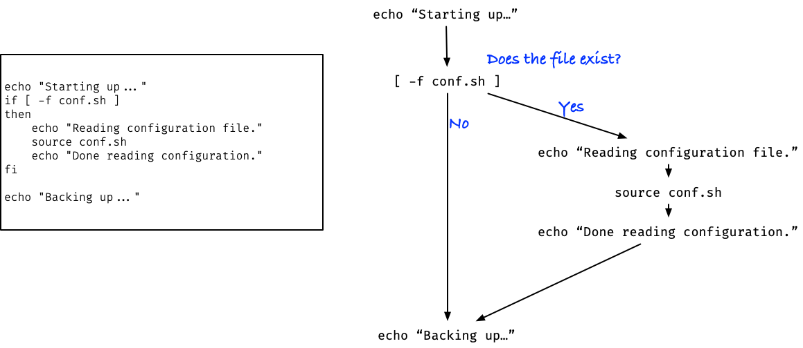

# Programming in the shell

UNIX shells practically all have some programming support. It is not necessarily the kind of programming you are familiar with if you have experience with languages like Python or R or similar, but it is not completely dissimilar either. You will have support for looping and for taking different branches depending on conditions (`if`-statements and such), but the statements you write in a shell script are the kind of commands you know and love from the interactive shell, and the control flow constructions (that means the loops and such) reflect this.

We are going aiming to become expert shell programmers, and we are certainly not aiming at using shell programming as a replacement for more traditional languages (although some can be stretched that far). We will not see how you can emulate data structure or such complicated features. The purpose of this session is to see some of the things you can do in a shell to add control flow to shell scripts and, through that, create more flexible and powerful tools for yourself. For most users, that is all that they will ever need, but should you wish to delve further into shell programming at a later date, you will have a basis to build on, and there is plenty of online material that will help you continue down this dark path.

## Control and data flow

When we start making more complex commands, two main concerns should be on our mind: how is data processed, getting us from the input we have to the output we want, and which commands will be executed to get this done. The first we refer to as *data flow* and the second as *control flow*.

When you run shell commands, the data flow is typically handled through files and pipes. The pipelines we have already seen are a simple example of this. There, the output of one command flows into the input of the next, and along the way, each command transforms the data in some desired way. Data flow can be more complex than this, of course, with one program producing output that is used in multiple other commands, or one command might need the output of multiple previous commands. Simple pipelines cannot handle that, but we can store data in files and handle it that way. That is not the topic of this lesson, however, but something we will return to later.

The topic of this lesson is control flow, which describes which commands will run, in which order, and under which conditions. In the shell scripts we have seen so far, the commands mostly ran one after another. The script would run one command; when that command finished, it would move on to the next line in the file and execute the command there and then move on to the following command after that.


In the pipelines, all the commands run simultaneously while the data flows through them, but since we will not concern ourselves with the distinction between running something in parallel versus running commands sequentially, you can think of them as much the same as the shell script: one command running after another. With pipelines, it is just the data seeing this order of commands rather than the clock on the wall.


One command after another is the simplest form of control flow, but we have also seen cases where one command would only be executed conditionally on the result of another. For example, in one of the versions of our backup script, we would only `source` a configuration script if the file existed:

```bash
[ -f conf.sh ] && source conf.sh
```

Or we would create a directory only if it didn’t exist already:

```bash
[ -d results-$date ] || mkdir results-$date
```

When we have such expressions, the commands are not executed in a simple linear fashion. Sure, they are executed one by one, but which commands depend on the state of your system. You can think of running the script as flowing through a graph of commands, where which path you take depends on the results of the tests you make. In the figure below, we have a bit of the backup script on the left, and on the right, we have the corresponding commands. There is an edge between two commands if one might be executed after the other, and after the directory test, we see that the next command depends on the result of the test. If the directory exists, we continue down to the `cp ...` command, but if it doesn't, we will execute the `mkdir ...` command first.


It is in this way we view the commands when we talk about control flow (where you can think of “control” as the commands we execute).

Logical operators are a simple way to get control flow (simple, if not exactly easy to read and decode). Others are both more powerful and easier to work with when things get complicated, and those are the topic for today.

First, however, we need to talk about tests. Whenever we need to choose which command to execute next, we need some form of test. In the backup script, we tested for the existence of files or directories using `[ -f … ]` or `[ -d … ]`, but there is a host of different ways of testing and we will do a whirlwind tour through them now.

## Testing stuff

Much of the control flow boils down to testing if something is true or false. "If this file exists, then do that...". "While there is more data, do this...". In a shell, however, you rarely see explicit true or false values, which is also the case for the bash shell. Instead, shells run commands and check the status of the commands to determine if something is "true" or "false". And there are multiple ways of doing that.

### Running a command

Generally, whenever you run a command, it will report back its status to the shell. You cannot do much with that status yet, but you can check what the result of the latest command was by printing the variable `$?`.

```bash
~> true ; echo $?
0
~> false ; echo $?
1
```

Here, `true` and `false` are not boolean values, but commands you can execute. They return true and false, respectively, but in the sense that the shell can understand, and as you can see, that is the exit status zero for true and one for false. Generally, the shell will consider any non-zero return status as "false" for programming purposes.

### Using `test`

The tests we have used so far, i.e. `[ -d … ]` and `[ -f … ]` are calling the command `test`. The square bracket syntax is just an alternative to calling this command, so

```bash
~> [ -f conf.sh ] ; echo $?
0
```

and

```bash
~> test -f conf.sh ; echo $?
0
```

are doing the exact same thing.

The `test` command is the go-to command for testing file and directory properties. We have used it to test if a file exists, option `-f`, or whether a file exists and is a directory, option `-d`, and these are the most common file tests. However, if you need to test for other file properties, e.g. whether the file exists and is executable (`-x`) or whether you can write to it (`-w`), then check `man test`.

The `test` command also provides several string tests. You can, for example, test if two strings are the same:

```bash
~> [ "foo" = "bar" ]; echo $?
1
~> [ "foo" = "foo" ]; echo $?
0
```

This, alone, is, of course, useless. We can immediately see if the strings are the same. But combined with variables, it gives us a way to check if a variable has a specific value.

```bash
~> foo="foo"
~> [ $foo = "foo" ]; echo $?
0
~> foo="bar"
~> [ $foo = "foo" ]; echo $?
1
```

The `test` operators you are most likely to find a use for are these:

| Expression | Meaning |
|:--|:--|
| `-d file` | True if file exists and is a directory. |
| `-e file` | True if file exists (regardless of type). |
| `-f file` | True if file exists and is a regular file. |
| `-k file` | True if file exists and its sticky bit is set. |
| `-p file` | True if file is a named pipe (FIFO). |
| `-r file` | True if file exists and is readable. |
| `-s file` | True if file exists and has a size greater than zero. |
| `-w file` | True if file exists and is writable. |
| `-x file` | True if file exists and is executable. |
| `-n string` | True if the length of string is nonzero. |
| `-z string` | True if the length of string is zero. |
| `file1 -nt file2` | True if `file1` exists and is newer than `file2`. |
| `file1 -ot file2` | True if `file1` exists and is older than `file2`. |
| `file1 -ef file2` | True if `file1` and `file2` exist and refer to the same file. |
| `string` | True if `string` is not the null string. |
| `s1 = s2` | True if the strings `s1` and `s2` are identical. |
| `s1 != s2` | True if the strings `s1` and `s2` are not identical. |
| `s1 < s2` | True if string `s1` comes before `s2` based on the binary value of their characters. |
| `s1 > s2` | True if string `s1` comes after `s2` based on the binary value of their characters. |
| `n1 -eq n2` | True if the integers `n1` and `n2` are algebraically equal. |
| `n1 -ne n2` | True if the integers `n1` and `n2` are not algebraically equal. |
| `n1 -gt n2` | True if the integer `n1` is algebraically greater than the integer `n2`. |
| `n1 -ge n2` | True if the integer `n1` is algebraically greater than or equal to the integer `n2`. |
| `n1 -lt n2` | True if the integer `n1` is algebraically less than the integer `n2`. |
| `n1 -le n2` | True if the integer `n1` is algebraically less than or equal to the integer `n2`. |

In addition, you have available logical operations:

| Expression | Meaning |
|:--|:--|
| `( expr )` | Same logical value as `expr`. You can just set parentheses to group an expression. |
| `! expr` | Logical NOT. Is false if `expr` is true and vice versa. |
| `expr1 -a expr2` | Logical AND. Is true if and only if both of `expr1` and `expr2` are true. |
| `expr1 -o expr2` | Logical OR. Is true if at least one of `expr1` or `expr2` are true. |

Read `man test` for the whole story.

### Using `let`

The `let` command is not directly a command for testing, but it gives you arithmetic operations and is frequently used for testing because of that.

With `let`, you can execute one or more expressions:

```bash
~> let expr1 [expr2 expr3 ...]
```

For example, the following evaluates three expressions, two assignments and a multiplication:

```bash
~> let a=2 b=4 a*b
```

The command sets the variable `a` to 2, then the variable `b` to 4, and finally multiplies the two.

It doesn’t write the result anywhere (and it doesn’t put it in `$?` either; that is reserved for reporting success or failure), so it is not immediately obvious that the command computed anything. If you want the result, however, you can put it in a variable; the variables that `let` sets will be available as shell variables as well:

```bash
~>let a=2 b=4 res=a*b ; echo "$a * $b = $res"
2 * 4 = 8
```

Left of the `;`, we run the `let` command, and there variables are not prefixed by `$`, but on the right, we run the shell command `echo`, and here we need `$` to get the value of a variable.

In the `echo` command, I put the output in a string. If I didn’t, the `*` would expand to the files in the current directory, and the output would get weird. Try it, if you don’t believe me. On the left, in the `let` command, I didn’t use quotes, but I only got away with that because I didn’t have any spaces around `*` or any of the assignments. If you put spaces in one of the `let` command’s arguments, it will consider it multiple expressions, and that will not work. This is one argument to `let`:

```bash
~> let a=2
```

However, this is three arguments

```bash
~> let a = 2
```

If you want spaces, use quotes:

```bash
~> let "a = 2" "b = 4" "res = a * b" ; echo "$a * $b = $res"
2 * 4 = 8
```

Where testing comes in with `let` is when the last expression is a numerical comparison. If, for example, we want to check if `a` times `b` equals some other variable `foo`, we can do:

```bash
~> foo=8 let "a = 2" "b = 4" "a * b == foo" ; echo $?
0
~> foo=16 let "a = 2" "b = 4" "a * b == foo" ; echo $?
1
```

Let’s unpack this because a lot is going on here. The first assignment, `foo=8` or `foo=16`, is just a variable assignment in the shell, as we know and love them. Then we run the `let` command that computes `a * b` and compares with `foo`. Although `foo` is a variable in the shell and not one we set in `let`, it knows about it. It knows all your shell variables as needed. Because the last expression is a comparison, `let`’s return status will be zero if the comparison was true and one if it was not.

Here’s another example. Say we want to know if a file is big or small (where we define “big” as any file with more than 100 lines). We can get the number of lines in a file using the `wc` command, so something like `filesize=$( wc -l $filename )` will put the size in the variable `filesize`. Once it is there, we can use `let` to check if it is bigger or smaller than 100:

```bash
filesize=$( wc -l < $filename )
let "filesize > 100" && echo "$filename is big" || echo "$filename is small"
```

We used an ugly logical expression here again, but soon we will move on from that and write some more readable commands. I promise.

If you want to work with numerical variables, the `let` command has most of the functionality you will need. If you then want to compare numbers to control the flow of a script, you can use the status from `let` if the final expression is a comparison.

The operators you have available in `let` are these:

| Operator | Meaning |
|:--|:--|
| `var++` | Post-increment: returns the current value of `var` and then add one to `var`. |
| `++var` | Pre-increment: add one to `var` and then return the new value. |
| `var--` | Post-decrement: returns the current value of `var` and then subtract one from `var`. |
| `--var` | Pre-decrement: subtract one from `var` and then return the new value. |
| `-expr` | Unary minus. Return `expr` multiplied by -1. |
| `+expr` | Unary plus. Return `expr` multiplied by 1. |
| `! expr` | Logical NOT. Return false if `expr` is true and vice versa. |
| `~expr` | Bitwise negation: flip all the bits in `expr`. |
| `a ** b` | Exponentiation: raise `a` to the power of `b` (both integers). |
| `*`, `/`, `%`, `+`, `-` | Basic arithmetic (multiplication, division, remainder/modulo, addition and subtraction). |
| `<<` and `>>` | Bitwise shift (left and right). |
| `<`, `<=`, `>`, `>=` | Numerical comparisons. |
| `==` and `!=` | Comparison (equal and unequal). |
| `&`, `\|`, and `^` | Bitwise AND, OR, and XOR. |
| `&&` and `\|\|` | Logical AND and OR. |
| `expr1 ? expr2 : expr3` | Conditional operator: If `expr1` is true, return `expr2`. If `expr1` is false, return `expr3`. |
| `var = expr` | Assignment. Set `var` to the value of `expr`. |
| `*=`, `/=`, `%=`, `+=`, `-=`, `<<=`, `>>=`, `&=`, `^=`, `\|=` | Assignment operators. The expression `a op= b` has the effect of `a = a op b`. |

## Parentheses preposterousness

This section will be a bit messy. I apologise for that. Well, I do not apologise because I didn't do any of the damage, but I am sorry that it is this way. The bash shell uses different kinds of parentheses for different purposes, and you always need to pick the right one for the job when you program in bash. There isn't much system to it, so you have to memorise which kinds of parentheses are needed for which kind of jobs.

Single parentheses run commands in a sub-shell. That is the same as running the commands in a shell script, in the sense that any changes you make to the shell's status and environment only affect the new shell and not the current one. For example, if you set variables, the variables affect the new shell and not the old one:

```bash
~> x=foo
~> ( x=bar ; echo $x )
bar
~> echo $x
foo
```

If you change directory, the rule is the same: you change the status of the new shell but not the current one.

```bash
~> pwd
/home/mailund
~> ( cd / ; pwd )  # changing dir in the sub-shell
/
~> pwd # We didn't change dir in this shell
/home/mailund
```

Adding `$` to the sub-shell command, you get the output back in a form you can use to substitute text:

```bash
~> echo $( x=bar ; echo $x )
bar
```

Single parentheses can be used as test conditions because they are commands like any other command.

```bash
~> (echo "foo" ; true) ; echo $?
foo
0
~> (echo "foo" ; false) ; echo $?
foo
1
```

Other than that, they are not directly related to testing, unlike the other parentheses variants that we will examine below.

### Using `test` as `[ ... ]` or `[[ ... ]]`

Expressions in single square brackets, `[ expr ]`, are just alternative syntax for `test expr`. The two ways of writing a test work exactly the same, and in my experience, it is about fifty-fifty what people use in the wild. I personally find the `[ ... ]` syntax more readable, but that is probably a matter of what I am experienced with rather than any qualitative difference between the two ways of testing.

Bash being bash, it couldn’t possibly stick to only two ways of doing such tests (or four or five for that matter). Since we have syntax with single parentheses, `( ... )`, for running commands in a sub-shell, and double parentheses, `(( ... ))` for testing using `let`, we couldn’t possibly just have one version with single square brackets. Oh no. We also have syntax for double square brackets: `[[ ... ]]`.

It is not too bad, though. Unlike `( ... )` and `(( ... ))` that do utterly different things, `[[ expr ]]` does the same as `[ expr ]` except that the former is part of the shell language and not simply running a command (`test`), so the syntax inside `[[ ... ]]` is less restricted.[^1]

[^1]: Coming to think about it, maybe it isn’t better to have a similar syntax that does *almost* the same compared to similar syntax that at least doesn’t behave the same. I don’t know. I find it all a big mess, but I live by the stoic philosophy that tells me next to nothing is under my control, so I might as well just get on with it.

The `[[ ... ]]` construction can work out that when you use a variable, you probably refer to a single token. So, for example, if you have a file name with a space in it:

```bash
~> touch 'foo bar'
~> ls 'foo bar'
foo bar
```

You might imagine that you could do something like this to test if it is present:

```bash
~> x='foo bar'
~> [ -f $x ]; echo $?
```

Try it; I dare you.

It will fail because the variable `$x` expands to `foo bar`, and you will run the command `test -f foo bar`. Now, `test` doesn’t like this because it expects a single file name after `-f`, so it will complain.

If you instead use

```bash
~> [[ -f $x ]]; echo $?
0
```

it works just fine. Since bash interprets what you write in `[[ ... ]]`, it is smarter than `test`, which will get the arguments *after* the variable `$x` is expanded. It can’t possibly know that the arguments `foo` and `bar` were previously part of the same variable.

It is not that you cannot do it with `test`, but you have to quote variables by putting them in `" ... "`

```bash
~> [ -f "$x" ]; echo $?
0
```

With `[ ... ]`, you tend to have to quote *a lot* of variables. The alternative `[[ ... ]]` construction is better at dealing with expanded variables.

Because `[[ ... ]]` can interpret the input better than a command can (because it sees it before we do all the shell expansions and transformations that normally happens when we execute a command), we can also use more familiar notation than we can with a command, when the notation clashes with other shell notation.

Comparison operations are examples of this. In a shell command `<` and `>` are used to redirect `stdin` and `stdout`, so we can’t write `test a < b` and get away with it. Since the `[ ... ]` notation means the same as calling `test`, we cannot do it there either. We can, however, do it with `[[ ... ]]`:

```bash
~> [[ a < b ]]; echo $?
0
```

Again, it is not that it is impossible to use shell operators as operators for a command; you would just have to quote or escape the operators somehow, making expressions less readable. This will work fine, it is just ugly:

```bash
~> [ a \< b ]; echo $?
0
```

When you compare numbers with either `[[ ... ]]` or `[ ... ]`, you have to be careful, though. Comparisons are textual, not arithmetical. `[[ 10 > 9 ]]` is false because the *string* “10” is sorted before the *string* 9.

```bash
~> [[ 10 > 9 ]]; echo $?
1
```

With the `let` command, `(( 10 > 9 ))`, the comparison is arithmetical, and the *number* 10 is greater than the *number* 9.

The two test commands can compare numbers, but you need different operators. The *numerical* greater than is `-gt`, so you would write

```bash
~> [[ 10 -gt 9 ]]; echo $?
0
```

Or, of course, you could use the `let` or `(( ... ))` syntax.

```bash
~> (( 10 > 9 )); echo $?
0
```

A powerful feature of the `[[ ... ]]` syntax that isn’t supported by `[ ... ]` is textual *pattern matching*. There are two different kinds of these: the glob/wildcard patterns you know from files and the shell and then regular expressions. [Regular expressions](https://en.wikipedia.org/wiki/Regular_expression) is far too broad a topic to cover in this lesson, but it is a way of describing classes of strings, not unlike how shell wildcards can be used to match file names that follow a given pattern. Regular expressions are more powerful but also harder to learn to master.

If you compare strings using `[[ x = pat ]]` or `[[ x == pat ]]`, then the command will check if the string `x` matches the (glob) pattern `pat`.

```bash
~> f=foo.txt
~> [[ $f == *.txt ]]; echo $?
0
```

This is true because `foo.txt` matches the pattern `*.txt`. If we use the `test` command, this won’t work either:

```bash
~> [ $f = *.txt ]; echo $?
1
```

That command tests whether `$f` is equal to the string `*.txt`, not whether it matches the pattern `*.txt`.

The `==` test, unlike normal equality, is not symmetric:

```bash
~> [[ $f == *.txt ]]; echo $?
0
~> [[ *.txt == $f ]]; echo $?
1
```

The pattern `foo.txt` matches itself, but it doesn’t match the string `*.txt`.

We could use something like that to determine the file type based on the file name’s suffix:

```bash
[[ $filename = *.txt ]] && echo $filename "is a .txt file"
[[ $filename = *.md ]]  && echo $filename "is an .md file"
```

When you test using `=` or `==`, you always use glob patterns, but if you instead use `=~` — `[[ x =~ pat ]]` — then `pat` is interpreted as a regular expression instead of a glob.

As mentioned above, we won't go into the details of regular expressions, but as an example, the string `^fo+$` will match any string that starts (`^`) with an f (`f`) and then is followed by one or more o's (`o+`) and then ends (`$`) without anything else following the o's.

```bash
~> [[ foo =~ ^fo+$ ]]; echo $?
0
~> [[ f =~ ^fo+$ ]]; echo $?
1
~> [[ fo =~ ^fo+$ ]]; echo $?
0
~> [[ foo =~ ^fo+$ ]]; echo $?
0
~> [[ foobar =~ ^fo+$ ]]; echo $?
1
```

With glob pattern matching, we cannot do as detailed specifications for what we want to match as we can with regular expressions, but what regular expressions have in expressiveness, they pay for in simplicity. You can learn everything there is to know about globs in an hour, but you are likely to still find regular expressions challenging after years of experience.

Anyway, enough about pattern matching.

If you are in doubt about which test construction to use, `[ ... ]` or `[[ ... ]]`, use the `[[ ... ]]` construction. It will almost always behave the same as `[ ... ]` (with the caveats on text matching and variable expansion), but it can do more.

### Using `let` as `(( ... ))`

Double parentheses have the same meaning as using `let`, with a few modifications. You don’t need to put expressions in quotes as aggressively. The `(( ... ))` is not a simple shell command, so it is better at figuring out that what you give it is an expression and not a sequence of otherwise unrelated command arguments. Because it allows spaces in the expressions without quotes, you can’t use spaces to separate expressions if you give `(( ... ))` more than one, so in that case, you need to use commas instead. The operations you have in `(( ... ))` and the operations you have with `let` are the same, however.

```bash
~> let a=2 b=4 res=a*b ; echo "$a * $b = $res"
2 * 4 = 8
~> (( a = 2, b = 4, res = a * b )); echo "$a * $b = $res"
2 * 4 = 8
```

## If-statements

We have used logical operators `&&` and `||` for control flow in forms such as these:

```bash
~> test && action # action is only run if test is true
~> test || action # action is only run if test is false
```

With if-statements, we get the same functionality but somewhat more readable, especially if `action` is more complicated than a single command.

The syntax for if-statements looks like this:

```bash
if test
then
 action
fi
```

or

```bash
if test; then
 action
fi
```

(The two are really the same since the `;` in the second version functions like a newline and generally does that in the shell, and which of the two forms you prefer is entirely a matter of taste).

This construction will run `test`, and if it is true (returns with status zero), then it will also run `action`. In that sense, it works like the `test && action` construction.

If you want to run `action` only when `test` is false, put a `!` in front of `test`:

```bash
if ! test; then
 action
fi
```

In the backup script we wrote when learning about shell scripts we could have used an if-statement to check if the configuration file existed like this:

```bash
echo "Starting up..."
if [ -f conf.sh ]
then
    echo "Reading configuration file."
    source conf.sh
    echo "Done reading configuration."
fi

echo "Backing up..."
```



Similarly, we could use an if-statement to create the backup directory if the directory didn't already exist:

```bash
if ! [ -d results-$date ]; then
    echo "Making backup dir results-${date}."
    mkdir results-$date
fi
```

Whether you want to use logical operators of if-statements is somewhat a matter of taste. For short commands like conditionally sourcing a file

```bash
[ -f conf.sh ] && source conf.sh
```

or for error handling

```bash
source conf.sh || exit 1
```

the succinct syntax of logical expressions can make the instructions easier to read (after some practice, admittedly). If you need multiple statements in the inner block of commands, then if-statements are usually the way to go.

If the conditions and control flow gets more complicated, you also want to use the if-statement construction, and then there is a bit more syntax to make that more readable.

With logical expressions, you can specify that if a command returns true, then one action should be done, and if it returns false, another should run.

```bash
test_cmd && action_if_true || action_if_false
```

The `&&` operator will only execute the second argument if the first is true, so `action_if_true` is only run if `test_cmd` is true. The `||` operator will only execute the second argument if the first is false, so `action_if_false` will only execute if `test_cmd` is false.

```bash
~> true && echo foo || echo bar
foo
~> false && echo foo || echo bar
bar
```

I hope that sounded convincing, as I did my best to write it that way, but it isn’t true.

```bash
~> true && false || echo bar
bar
```

The test condition was true, we were only supposed to run the `action_if_true` command, but since *that* action returned false, we also ran the `action_if_false`.

The actual rule here is that if the `test` is false, then we know that `(test && action_if_true)` will be false, and then we run `action_if_false`. That part works. However, we run `action_if_false` *whenever* `(test && action_if_true)` is false, regardless of whether it was the test or the action that returned a non-zero status.

You *can* express that a test should select one action or another using logical expressions:

```bash
test_cmd && (action_if_true || true) || action_if_false
```

If `test_cmd` is true, we run `(action_if_true || true)` and that will always be true, so we don’t invoke `action_if_false`. If `test_cmd` is false, then we skip `(action_if_true || true)` and execute `action_if_false`. So, it can be done, but it is not exactly readable.

Generally, my advice is to stick to logical operators when they are simple; you can easily write something like our first attempt that looks right but isn’t.

With if-statements, it is trivial to select between two actions; you simply need the `else` keyword:

```bash
if test_cmd; then
 action_if_true
else
 action_if_false
fi
```

If you add `else` on its own line after the actions you want to run if the test is true, then you can put commands you only want to run if the test is false afterwards.

Let’s play a bit with an example. You probably love Googling yourself (because who doesn’t), but would you like to know how to see if any file mentions you? Let’s write a script for that!

The command `whoami` will return your username, and that is what we will search for. We will use the command `grep` to scan through files to find it. The command

```bash
~> grep $(whoami) *
```

will look at all the files in your current directory. Remember here that when we write `$(whoami)`, we run the command `whoami`, take the output, and paste it into the command line, so what `grep` sees is your username, not `$(whoami)`.

If `grep` finds anything, it should return the status zero, so success or true, and if it doesn’t, it will return false. So, something like this will tell you if someone has mentioned you:

```bash
if grep $(whoami) *
then
    echo "Someone is thinking of me"
else
    echo "No one cares about me!"
fi
```

Well, not quite. Nothing is ever simple. While `grep` will return non-zero (false) when it doesn’t find what it is searching for, it will also return false if there are any errors. If you run this in a directory that contains other directories, it will complain that it can’t search in those, and it will return false regardless of whether it finds your username:

```bash
~> grep $(whoami) *
grep: img: Is a directory
programming.md:/home/mailund
programming.md:/home/mailund
~> echo $?
2
```

Here, it finds `mailund` (which happens to be my username) twice in the file `programming.md` (which happens to be this file), but the return status is two because it couldn’t search in `img`, which is a directory. If I used this test, I would falsely conclude that no one cares about me (which I know, dear reader, that you do).

Ok, first attempt to fix this: if you use `ls -p` it will add `/` to the end of directories, and if you then run that through `grep -v /` it will give you all the files that do not (`-v`) contain a slash. So this command will grep only in regular files:

```bash
~> grep $(whoami) $(ls -p | grep -v /)
```

Are you beginning to see how powerful the shell is yet when you can combine small commands to create more complex ones?

With that insight, we can update the script to:

```bash
if grep $(whoami) $(ls -p | grep -v /)
then
    echo "Someone is thinking of me"
else
    echo "No one cares about me!"
fi
```

You get the output from the outer `grep` command when you run this, and if that contains a lot of lines there are two observations: you are popular, congratulations, and all those lines will swamp the `echo` command we carefully put in our script. Instead of that, we can collect the files you are mentioned in and print only those.

To do that, remember (or read `man grep`) that the option `-l` will make `grep` print the file names only.

```bash
~> grep -l $(whoami) $(ls -p | grep -v /)
programming.md
```

It appears that I am only mentioned in one file…

If you are looking only in your own directory, then this will probably suffice, but the script isn’t quite perfect yet. We will still get errors from `grep` if we try to scan a file we do not have read permissions for. The `ls -p | grep -v /` trick will only tell us which files are directories, but not if we have a regular file that `grep` cannot scan. To fix that, we need to abandon `ls` and `grep` and use a new command you haven’t seen before: `find`. You use it to, well, find files, and you can use a ton of options to specify which files to find. We will use the command to search only the current directory `.` and not into sub-directories `-maxdepth 1`, and we will tell it to find regular files `-type f`.

```bash
~> find . -maxdepth 1 -type f
```

If we then use the `$(...)` construction, we can get the output and give it to `grep` as the files to search in:

```bash
~> grep -l $(whoami) $(find . -maxdepth 1 -type f)
```

If you prefer, you could also put the result of `find` in a variable, so you don’t have too much going on in a single command:

```bash
~> files=$(find . -maxdepth 1 -type f)
~> grep -l $(whoami) $files
```

If we go completely crazy, we can now put the entire `grep` command in `$(...)` so we can get both its output—the files we are mentioned in—and the status of the search:

```bash
files=$(find . -maxdepth 1 -type f)
if me_files=$(grep -l $(whoami) $files)
then
    echo "I am mentioned in: ${me_files}"
else
    echo "No one cares about me!"
fi
```

If you feel that this is too messy and that too much is going on in the test, then you can move the `grep` command out of the test.

```bash
files=$(find . -maxdepth 1 -type f)
me_files=$(grep -l $(whoami) $files)
```

You can still assign its output to the variable, but now you cannot test the return status directly. However, as we’ve seen many times, the status of the last command is in the variable `$?` and we can exploit that. You cannot do `if $? …` since `$?` is not a command, but you can use the `(( ... ))` construction to test if it is zero:

```bash
files=$(find . -maxdepth 1 -type f)
me_files=$(grep -l $(whoami) $files)
if (( $? == 0 ))
then
    echo "I am mentioned in: ${me_files}"
else
    echo "No one cares about me!"
fi
```

This only works for testing the status of the last command you ran, but if you want to save the status you can put it in a variable. We can, for example, use the `(( … ))` construction of the `let` command to set a variable to true or false depending on the previous command’s status, and then later use `(( ... ))` to test the variable:

```bash
files=$(find . -maxdepth 1 -type f)
me_files=$(grep -l $(whoami) $files)
(( found_me = ? == 0 )) # Use (()) to set found_me

if (( $found_me ))
then
    echo "I am mentioned in: ${me_files}"
else
    echo "No one cares about me!"
fi
```

You cannot use `if $found_me …` like that, since `$found_me` is not a command, but by putting it in `(( ... ))`, we turn it into a command, and it will be true if `found_me` is true, and because we set `found_me` to `$? == 0` right after the `grep` command, `$found_me` is true if the `grep` command succeeded and false otherwise.

I write `(( $found_me ))` in the if-statement’s test to make it clear that `$found_me` is a shell variable, but since we are inside `(( ... ))`, you can leave out the `$` and write `(( found_me ))`. That is a matter of taste. The same goes for using `(( ... ))` for setting the variable. The `let` command (with quotes where necessary) would work just as well:

```bash
let "found_me = $? == 0"  # Use 'let' to set found_me
```

Now that I come to think of it, though, we might have been looking too binary on popularity. It is not like being mentioned or not is the statistics we should focus on. After all, it is little consolation to be mentioned once or twice if everyone else is mentioned a ton of times.

Let’s count how many times we are mentioned.

We used `grep -l` to get the files we are mentioned in. Remove that option, and `grep` will give us each line we are mentioned in. Now, we could be mentioned twice in the same line, like right here: `thomas mailund is the greatest mailund`, but counting occurrences per line is extra work, and for the little expected gain from it, it isn’t worth it. We will settle for counting the lines we are mentioned in. To get that, get the lines from `grep` and count them with `wc -l`:

```bash
files=$(find . -maxdepth 1 -type f)
mentions=$(grep $(whoami) $files | wc -l)
```

Now, `$mentions` contains the number of times we are mentioned (or at least the number of lines we are mentioned in), and we can use that to graduate how popular we are:

```bash
if (( mentions > 10 ))
then
    echo "I should be making that influencer big bucks!"
else
    if (( mentions > 5 ))
    then
        echo "Ok, at least I'm more popular than Dan Søndergaard"
    else
        if (( mentions > 0 ))
        then
            echo "At least my mother cares..."
        else
            echo "No one cares about me!"
        fi
    fi
fi
```

At this point, I should probably tell you that the whole popularity story was a ruse. I wanted to get to this point and show you that you can nest if-statements and also show you that nesting deeper and deeper looks ugly.

In this example, we choose different actions based on the value of `mentions`, and if you look carefully, you will see that the conditions are non-overlapping. If `mentions > 10`, we only do the “true” part for the test. If `mentions` is smaller or equal to 10, we go to the else part, and there we do the first action if `mentions > 5`, so that part is done only when `5 < mentions <= 10`. If that isn’t true, we know `mentions <= 5`, and we choose two different actions depending on whether `0 < mentions <= 5` or `mentions == 0`.

When you have a series of tests, and you pick the first that is true, you can use another construction: `elif`. It works just as the nested if-statements but without all the crazy nesting.

```bash
if (( mentions > 10 ))
then
    echo "I should be making that influencer big bucks!"
elif (( mentions > 5 ))
then
    echo "Ok, at least I'm more popular than Dan Søndergaard"
elif (( mentions > 0 ))
then
    echo "At least my mother cares..."
else
    echo "No one cares about me!"
fi
```


You can have as many as you like after the first `if`, and you can leave out the final `else` part if you don’t need it. When bash processes it, it will evaluate the tests from top to bottom, and the first time something is true, it will do that branch of the statement, and when done, it will skip past the rest of the blocks to the final `fi`.

Sometimes, you do want to nest if statements. The `elif` construction only handles when you have a sequence of test conditions and you want to execute the commands associated with the first true test. When things are more complicated than that, nesting, or perhaps a mix of `elif` and nested if statements, is the way to go.

## Cases

The `case … in` construction works much like the `if … elif …` construction in that it checks a sequence of conditions and picks the first that is satisfied. After that, though, the similarities end.

With `case`, you will check a string against a number of patterns, and the first pattern that matches the string determines which actions you will execute. The overall syntax looks like this:

```bash
case text in
   pat1)
	   actions
	   ;;
   pat2)
	   actions
	   ;;
   ...
esac
```

The patterns you test look like globs with a few modifications:

 - Most characters (any character that doesn't have a special meaning as described above) match themselves.
 - `?` matches any single character.
 - `*` matches any sequence of characters.
 - `$var` will expand the variable before matching.
 - `[abc...]` will match any of the characters in the `[…]` brackets.
 - `[a-z]` will match any one character in the range of characters.
 - `pat1 | pat2` will match either `pat1` or `pat2`.

If you match a pattern, you will execute the actions in its associated block, and that block is terminated by `;;`.

For a concrete example, consider classifying a file based on its filename. The suffixes in file names are often used to indicate what type of file we have, and we can exploit that in a `case` statement like this:

```bash
case $filename in
    *.txt)
        echo "$filename is a text file"
        ;;
    *.md)
        echo "$filename is a markdown file"
        ;;
    *.sh)
        echo "$filename is a shell script"
        ;;
    *)
        echo "I don't know what $filename is"
        ;;
esac
```

If you don't mind a more coarse-grained classification, we can try the `pat1 | pat2` patterns (and you will notice that this works for more than two patterns as well):

```bash
case $filename in
    *.txt | *.md)
        echo "$filename is a text file"
        ;;
    *.sh | *.py | *.r | *.R)
        echo "$filename is a script"
        ;;
    *)
        echo "I don't know what $filename is"
        ;;
esac
```


## For loops

We have managed so far to avoid loops, but that ends now. Sometimes, you need to deal with a sequence of objects, and you don't want to write the same commands over and over again. For that, we have loops, of which there are two kinds: `for` loops and `while` loops. We discuss the `for` loops first.

The syntax for a `for` loop is this:

```bash
for var in <what you want to run through>
do
	<what you want to do>
done
```

The `<what you want to run through>` can be many things, basically anything that gives you a sequence of something. What will happen with the `for` loop is that the variable `var` is set to each of the elements in `<what you want to run through>` in turn, and then all commands between `do` and `done` are run.

One of the simplest things we can iterate over, and one of the most useful, is filenames. The glob `*` matches all the files in the current directory (well, all the visible ones anyway), as you already know from `ls *`. If you want to loop through them, you can use the following:

```bash
for file in *
do
	echo $file
done
```

Let's make things a little more interesting. We can run through all the files in the current directory and classify them according to type, similar to what we did above with the `case` construction.

```bash
for filename in *
do
    case $filename in
        *.txt | *.md) textfiles="$textfiles $filename" ;;
        *.sh | *.py | *.r | *.R) scripts="$scripts $filename" ;;
        *) unknown="$unknown $filename" ;;
    esac
done
```

We put each file into one of three variables, `textfiles`, `scripts`, or `unknown`. These are variables that initially do not exist, but we create them the first time we assign to them. (If we read them before then, we will get the empty string, which is acceptable for our purposes).

Iterating through all files, we will put each file in one of the file type variables, and at the end, each of the three variables will have a space-separate list of filenames. Such a space-separated sequence is also something we can iterate through, and we can use that to print the filess:

```bash
filetypes="textfiles scripts unknown"
for filetype in $filetypes
do
    echo ${filetype}
    # Get the var name from $filetype, e.g. scripts, then
    # get the values in that var, e.g. $scripts.
    files_of_type=${!filetype}
    for filename in files_of_type; do
        echo " - $filename"
    done
    echo # newline
done
```

The `filetypes` variable is a sequence of the three file types.

```bash
filetypes="textfiles scripts unknown"
```

We iterate through it with a `for` loop, setting the variable `$filetype` to each of the values in turn. The construction `${!filetype}` is not one we have used before, but it will get the value in `filetype` (one of `textfiles`, `scripts` or `unknown`) and then evaluate the variable expansion once more to get the filenames of the given type. So the expansion could go like this:

```bash
${!filetype} -> $scripts -> "foo.sh bar.sh qux.py"
```

Once expanded this way, we have a list of file names, and those we can iterate through in the inner `for` loop to print the names.

Any shell expression—variable expansion or command or whathaveyou—that generates a list of words can be used for a for loop, so we could also run through the words in a file by `cat`'ing its content:

```bash
for word in $( cat file.txt ); do
    echo $word
done
```

Keep in mind, however, that you are iterating through the words (i.e. space-separated strings) in the file. You are not reading the file line by line. For that, we need a different construct, a `while` loop with the `read` command, as we shall see shortly.

If you want to iterate through a sequence of integers, something that might be more familiar to you if you have experience with programming, then you can exploit that bash will expand an expression like `{from..to}` into the sequence `from from+1 from+2 … to` (notice that `to` is included in bash, unlike some languages). To loop through the numbers one to five, you can thus write:

```bash
for i in {1..5}; do
    echo $i
done
```

This expansion syntax also allows for step sizes, `{from..to..step}`, so the following will go through the numbers five to fifty in steps of five:

```bash
for i in {5..50..5}; do
    echo $i
done
```

If you are familiar with C-family languages, you also get the syntax for that. It is less elegant, in my opinion, but it will perhaps be familiar to you. This will run through the numbers from zero up to (but not including) ten:

```bash
for (( i=0; i < 10; i++ )); do
 echo $i
done
```

and this will do it in steps of two:

```bash
for (( i=0; i < 10; i += 2 )); do
 echo $i
done
```

## Until and while loops

The `until` and `while` constructions do essentially the same thing. With `until`:

```bash
until cmd; do
	something
done
```

you will repeatedly do `something` until `cmd` returns a false status, and with `while`:

```bash
while cmd; do
	something
done
```

you will repeat `something` until `cmd` evaluates to false.

As a somewhat artificial example of using `until`, consider picking random numbers but rejecting any numbers not between 10 and 1000. (I said it was artificial, there is no need for rejection sampling here, but it is just an example).

```bash
until (( x=$RANDOM, 10 <= x && x < 1000 )); do
    echo "${x} is not good enough"
done
echo "Let's go with ${x}"
```

Here, the command after `until` is `(( x=$RANDOM, 10 <= x && x < 1000 ))`, so we are using the `((...))` construction. We have two expressions inside: one that sets `x` to a random number, `x=$RANDOM` (the variable `$RANDOM` will give you a random number), and the second expression is the test `10 <= x && x < 1000` which tests if `x` is in the right range. Inside the loop body, we print the value we rejected, so here, `$x` is outside the desired range, but if it ever hits inside the range, we leave the loop and print the final value.

As another example, imagine you have some job running that will `touch done.txt` when it is done. This script will then wait for completion and inform you about it:

```bash
until [[ -e done.txt ]]; do
    sleep 60 # Wait a minute and try again
done
echo "The job has been completed."
```

As we saw with the `for` loops above, we can run through all the words in a file using a loop and `cat`. To read the file line by line, however, we need the command `read`. It will read one line from `stdin` at a time (although options can change that a bit) and it will return true as long as it gets a line and false when there are no more.

```bash
while read line; do
    echo $line
done
```

When we call `read` in this code, it will read the next line from `stdin` and put it, without the newline character `\n` in `line`, and inside the loop body, we print the line.

Since `read` will read from `stdin`, you need to give it the file data on `stdin` if you want it to read from anywhere else, but you can do that using `cat`.

You cannot do

```bash
while read line < file; do
	echo $line
done
```

because then the command you are testing, `read line < file` is executed every time the loop returns to the test, and you will only ever get the first line in the file. Instead, you can `cat` to the entire loop:

```bash
cat file.txt | while read line; do
    echo $line
done
```

This will usually get whatever you need to do done, but there is a twist that can easily trip you up. When you pipe into a loop, the loop is run in a subshell—similar to when you run commands in parentheses. This won't be a problem most of the time, but if you use variables, it can be. Remember that variables you set in a subshell won't be seen in the calling shell.

If you tried to count the lines and words in a file, and then printing the results after the loop, you might write something like this:

```bash
linecount=0
wordcount=0
cat file.txt | while read line; do
    (( linecount++ ))
    for word in $line; do
        (( wordcount++ ))
    done
done
echo $linecount $wordcount
```

You might also be surprised that the result is always `0 0`.

It is not that the `while`-loop doesn't run, it does, and you can check that by printing something inside the loop. The cases is that the `linecount` and `wordcount` variables you update inside the loop are in a separate shell, and when the loop terminates, and the subshell is gone, you have lost the counts.

One way around this is to not use `cat` but redirect the file into the loop. This works differently than redirecting into `read` (which we saw didn't work), because now the redirected file is the input to the entire loop and not just the `read` command, and when you do it that way, you don't run the loop in a subshell.

```bash
while read line; do
    (( linecount++ ))
    for word in $line; do
        (( wordcount++ ))
    done
done < file.txt
echo $linecount $wordcount
```

(This time around, I didn't initialise the variables to zero; they will be that by default, so I left it out. Whether you want to do that or not is a matter of taste. I usually do, but I got tired of typing here, so I didn't this time).

One annoying thing about this solution is that the input file is hidden at the end of the loop, so it can be hard to figure out what is going on up front.

The third option is a little ugly since it involves opening and closing files explicitly. We can open a file and get a so-called *file descriptor*. File descriptors are numbers that UNIX uses to refer to open files, and the three pipes we have automatically are already file descriptors (`stdin` is 0, `stdout` is 1, `stderr` is 2). The `read` command can read from a file descriptor other than 0 (`stdin`).

You can open a new file and get its file descriptor with `exec {fd}<>file.txt`. Then the file descriptor is saved in `$df`. Once you have it, you can redirect the new file descriptor into `read`'s `stdin` with `<& $fd`, and that way read from the file. When you are done, you must close the file descritptor with `exec {df}<&-`. It's not pretty—I warned you—but it works.

```bash
exec {fd}<>file.txt # Open file as fd
while read line <& $fd; do # Read from fd
    (( linecount++ ))
    for word in $line; do
        (( wordcount++ ))
    done
done
exec {fd}<&- # Close fd
echo $linecount $wordcount
```

## Functions

We already saw functions when we learned how to write scripts. They work much the same way that scripts do, except that scripts are files, and functions are some syntax we give bash to tell it that we want a new command, what the command should be, and what it should do.

```bash
function name() {
	command1
	command2
	command3
}
```

(The `function` in front of the name is optional).

There is a little more to them, though, and we will finish this lesson by digging into that.

### Function arguments

Functions can take arguments the same way as scripts or programs can. Just like with scripts, the arguments are found in variables `$`*i* where *i* is a number. The variable `$0` refers to the name of the function (the same way that `$0` refers to the name of a script when you are running such a beast), the variable `$1` is the first argument, `$2` is the second, and so on. In addition, `$@` will expand to all the variables as separate strings and `$*` to all the variables as a single string (again, same as for scripts).

The function and script arguments are separate entities, even though they have the same names. If you ran this script

```bash
#!/bin/bash

show_args() {
    echo "Function arguments: $@"
}

echo "Script arguments: $@"
show_args foo bar baz
echo "Script arguments: $@"
```

the function arguments would always be `foo bar baz` regardless of what arguments you gave the script.

Having parameters is, not surprisingly, a useful thing to have. In the script we wrote earlier, we used a function for error handling like this:

```bash
function report_conf_error() {
    echo "Couldn't open conf.sh!"
    exit 1  # Exiting 1 means we are not claiming success
}
```

This function, however, is hardwired to mention `conf.sh`. Using a parameter, we can make a more general function, for example, something like this:

```bash
function error() {
    echo "ERROR: $1"
    exit 1
}
```

that we could then use like this:

```bash
if [ -f conf.sh ]
then
    echo "Reading configuration file."
    source conf.sh || error "Problems reading conf.sh"
    echo "Done reading configuration."
fi
```

A function works like a command, so you can catch its output as you can any other command:

```bash
greet() {
    echo "${1},  world!"
}

echo $(greet hello) # hello, world
echo $(greet howdy) # howdy, world
```

Here, we create a function, `greet`, that will print its argument and then `, world!`. If we call `greet hello`, it will print that to standard out, but if we catch it in `$(greet hello)` or `$(greet howdy)`, we catch the output and can use it in the main script.

A function call also has a return status. This will be the status of the last command you run in it. Consider this example:

```bash
read_conf() {
    # Function will source conf.sh if
    # it exists. Its return status
    # depend on whether we succeeded
    [ -f conf.sh ] && source conf.sh
}
read_conf || error "Problems reading conf.sh"
```

The `read_conf` function will try to source `conf.sh` if it exists. If everything goes right, its last (and only) command `[ -f conf.sh ] && source conf.sh` will give us a 0 return status, and that is what `read_conf` will return as well. If anything goes wrong, whatever non-zero status we get will also be the status of the function.

If you want to explicitly return a specific value, you can use `return`:

```bash
read_conf() {
    if [ -f conf.sh ]; then
        echo "Reading conf.sh"
        source conf.sh
    else
        echo "File doesn't exist"
        return 1
    fi
}

error() {
    echo $1
    exit 1
}

read_conf || error "Problems reading conf.sh"
```

Notice that `return` and `exit` are very different commands. The `return` command will return from the function, but `exit` will terminate the entire script.

Variables you use inside functions can be either global or local. They are global by default, and being global means that what you set them to inside the function will also be their value outside the function. Local variables are declared with the keyword `local`, and these work like variables in a sub-shell: whatever you set them to inside the function won’t change what variables with the same name outside the function will contain.

Consider this code to illustrate the difference between local and global variables:

```bash
set_vars() {
    x="this is x in the function"
    local y="this is y in the function"
    echo "Inside function: x=${x}, y=${y}"
}

x="global x"
y="global y"

echo "Outside function: x=${x}, y=${y}"
set_vars
echo "Outside function: x=${x}, y=${y}"
```

Outside the function, we set `x` and `y` and print their values. Then we call the function, and inside the function, we also set `x` and `y`, but `y` inside the function is declared `local`. We print their new values and return from the function. Then we print the variables outside the function again. Here, we will see that the value of `x` was updated when we wrote to it in the function, but the value of `y` was not. The `x` we assigned to inside the function was the global one, so it has changed, but the `y` was local to the function, so we never touched the `y` outside the function.
